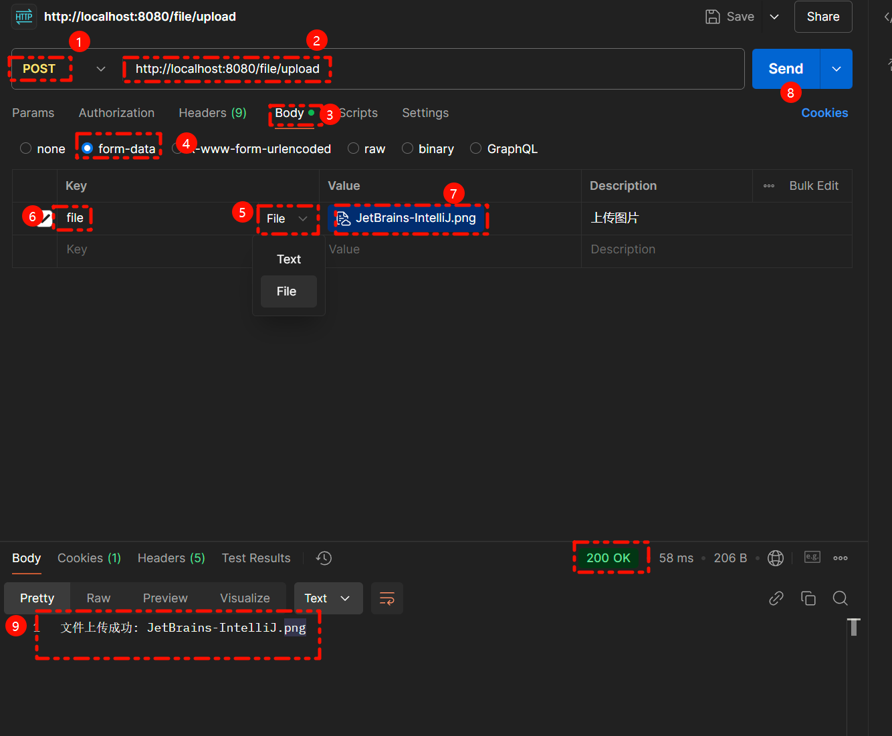
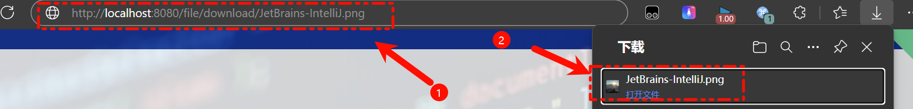

<!-- truncate -->

# Spring MVC 文件上传和下载功能实现指南

## 1. 新建 Spring 项目
1. **打开 IntelliJ IDEA**：
   - 点击 `File > New > Project`。

2. **选择 Spring Initializr**：
   - 填写项目基本信息：
     - Group: `com.example`
     - Artifact: `file-upload-download`
     - Type: Maven
     - Java Version: 17 或其他兼容版本。

3. **选择依赖**：
   - 添加以下依赖：
     - **Spring Web**（核心依赖，用于开发 MVC 应用）
     - **Spring Boot DevTools**（便于热加载开发）
     - **Lombok**（简化实体类编写）

4. **完成项目创建**：
   - 点击 `Next`，等待 IDEA 完成项目生成。

## 目录结构

最终的项目结构如下：

```css
📂 src
├── 📂 main
│   ├── 📂 java
│   │   └── 📂 com.example.fileuploaddownload
│   │       ├── 📄 FileUploadDownloadApplication.java
│   │       └── 📂 controller
│   │           └── 📄 FileController.java
│   ├── 📂 resources
│   │   └── 📄 application.properties
└── 📂 test
    └── 📂 java
```

##  配置项目

### 3.1 修改 `application.properties`
在 `src/main/resources/application.properties` 中添加以下配置：

```properties
# 文件上传临时路径和大小限制
spring.servlet.multipart.max-file-size=10MB
spring.servlet.multipart.max-request-size=10MB

# 配置静态资源文件夹，支持直接访问文件
spring.web.resources.static-locations=file:D:/uploads/
```

### 3.2 创建上传目录
- 在 `D:/` 目录下手动创建 `uploads` 文件夹，用于保存上传的文件。

## 4. 编写代码
### 4.1 创建 Controller 类
在 `src/main/java/com/example/fileuploaddownload/controller` 下创建 `FileController.java`：

```java
package com.example.fileuploaddownload.controller;

import org.springframework.core.io.Resource;
import org.springframework.core.io.UrlResource;
import org.springframework.http.HttpHeaders;
import org.springframework.http.ResponseEntity;
import org.springframework.web.bind.annotation.*;
import org.springframework.web.multipart.MultipartFile;
import org.springframework.http.HttpStatus;

import java.io.File;
import java.io.IOException;
import java.net.MalformedURLException;

@RestController
@RequestMapping("/file")
public class FileController {

    // 文件保存路径
    private static final String UPLOAD_DIR = "D:/uploads/";

    // 文件上传接口
    @PostMapping("/upload")
    public ResponseEntity<String> uploadFile(@RequestParam("file") MultipartFile file) {
        if (file.isEmpty()) {
            return ResponseEntity.status(HttpStatus.BAD_REQUEST).body("文件不能为空");
        }

        try {
            // 创建上传目录（如果不存在）
            File uploadDir = new File(UPLOAD_DIR);
            if (!uploadDir.exists()) {
                uploadDir.mkdirs();
            }

            // 保存文件
            String filePath = UPLOAD_DIR + file.getOriginalFilename();
            file.transferTo(new File(filePath));

            return ResponseEntity.ok("文件上传成功: " + file.getOriginalFilename());
        } catch (IOException e) {
            return ResponseEntity.status(HttpStatus.INTERNAL_SERVER_ERROR).body("文件上传失败");
        }
    }

    // 文件下载接口
    @GetMapping("/download/{filename}")
    public ResponseEntity<Resource> downloadFile(@PathVariable("filename") String filename) {
        try {
            // 文件路径
            File file = new File(UPLOAD_DIR + filename);
            if (!file.exists()) {
                return ResponseEntity.status(HttpStatus.NOT_FOUND).body(null);
            }

            // 转为资源对象
            Resource resource = new UrlResource(file.toURI());
            return ResponseEntity.ok()
                    .header(HttpHeaders.CONTENT_DISPOSITION, "attachment; filename=\"" + resource.getFilename() + "\"")
                    .body(resource);
        } catch (MalformedURLException e) {
            return ResponseEntity.status(HttpStatus.INTERNAL_SERVER_ERROR).body(null);
        }
    }
}
```

### 4.2 启动类
在 `src/main/java/com/example/fileuploaddownload` 下找到 `FileUploadDownloadApplication.java`：

```java
package com.example.fileuploaddownload;

import org.springframework.boot.SpringApplication;
import org.springframework.boot.autoconfigure.SpringBootApplication;

@SpringBootApplication
public class FileUploadDownloadApplication {
    public static void main(String[] args) {
        SpringApplication.run(FileUploadDownloadApplication.class, args);
    }
}
```

## 5. 启动项目
1. 点击右上角绿色三角按钮运行项目。
2. 确保项目运行成功，默认监听端口为 `http://localhost:8080`。

## 6. 测试接口
### 6.1 测试上传接口
- 使用 Postman 发送 `POST` 请求到：
  ```http
  http://localhost:8080/file/upload
  ```
- 请求参数：
  - **Key**：`file` (类型：File)
  - **Value**：选择本地文件。
- **响应**：
  ```cmd
  文件上传成功: example.txt
  ```
  
  

### 6.2 测试下载接口
- 在浏览器或 Postman 访问：
  ```
  http://localhost:8080/file/download/example.txt
  ```
- 文件将被下载到本地。
- 

至此，Spring MVC 文件上传和下载功能已完成！
