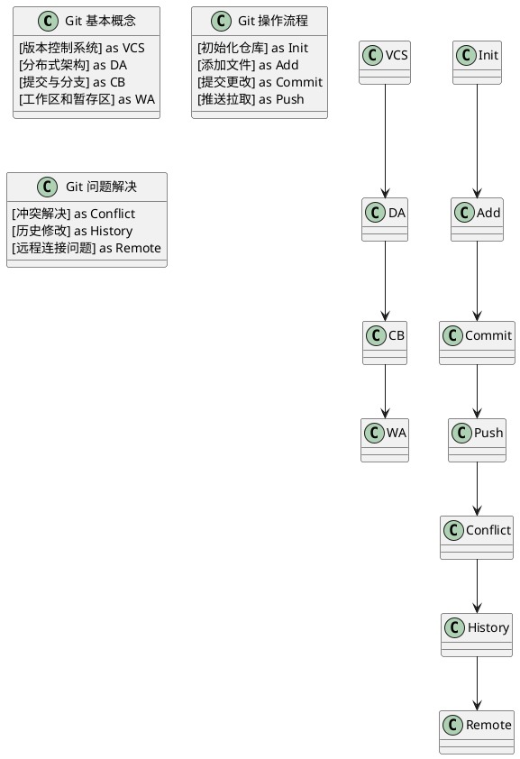

<!-- truncate -->

# Git基础教程：从入门到问题解决



Git是当今最流行的分布式版本控制系统，本文将全面介绍Git的基本概念、常用命令、操作流程以及常见问题的解决方案，帮助你快速掌握这一强大的开发工具。

## Git的基本概念

### 什么是Git？

Git是一个分布式版本控制系统，由Linux之父Linus Torvalds于2005年创建，用于Linux内核开发。与集中式版本控制系统（如SVN）不同，Git允许开发者在本地拥有完整的代码库副本，这意味着：

- 可以在没有网络连接的情况下工作
- 每个开发者都有完整的版本历史
- 分支和合并操作速度快且灵活

### Git的核心概念

了解以下核心概念对掌握Git至关重要：

1. **工作区（Working Directory）**：你实际编辑文件的目录
2. **暂存区（Staging Area/Index）**：保存将要提交的文件信息
3. **本地仓库（Local Repository）**：存储提交的历史记录
4. **远程仓库（Remote Repository）**：托管在服务器上的共享仓库

### Git的工作流程

Git的基本工作流程如下：

1. 在工作区修改文件
2. 将更改添加到暂存区（`git add`）
3. 将暂存区的更改提交到本地仓库（`git commit`）
4. 将本地仓库的更改推送到远程仓库（`git push`）

## Git入门：基本命令

### 安装Git

根据你的操作系统，安装Git的方法略有不同：

**Windows**:
下载并安装[Git for Windows](https://git-scm.com/download/win)

**macOS**:
使用Homebrew安装: `brew install git`
或下载[安装程序](https://git-scm.com/download/mac)

**Linux**:
Debian/Ubuntu: `sudo apt-get install git`
Fedora: `sudo dnf install git`

### 配置Git

安装Git后，首先应该配置用户信息：

```bash
# 配置用户名和邮箱
git config --global user.name "你的名字"
git config --global user.email "你的邮箱"

# 查看配置
git config --list
```

### 创建仓库

有两种方法创建Git仓库：

**初始化新仓库**:

```bash
# 创建新目录
mkdir my-project
cd my-project

# 初始化Git仓库
git init
```

**克隆现有仓库**:

```bash
git clone https://github.com/username/repository.git
```

### 基本操作

以下是日常使用Git的基本命令：

#### 查看状态和差异

```bash
# 查看仓库状态
git status

# 查看未暂存的更改
git diff

# 查看已暂存的更改
git diff --staged
```

#### 添加和提交更改

```bash
# 添加特定文件到暂存区
git add filename

# 添加所有更改到暂存区
git add .

# 提交暂存的更改
git commit -m "提交信息"

# 直接提交所有更改（跳过暂存区）
git commit -a -m "提交信息"
```

#### 查看历史

```bash
# 查看提交历史
git log

# 查看简洁的历史
git log --oneline

# 查看图形化的历史
git log --graph --oneline --all
```

#### 撤销更改

```bash
# 撤销工作区的更改
git checkout -- filename

# Git 2.23+版本的新命令
git restore filename

# 取消暂存
git reset HEAD filename
# 或
git restore --staged filename

# 修改最近的提交
git commit --amend
```

### 分支操作

分支是Git的强大功能之一，允许你并行开发不同的功能：

```bash
# 查看分支
git branch

# 创建分支
git branch branch-name

# 切换分支
git checkout branch-name
# 或Git 2.23+
git switch branch-name

# 创建并切换分支
git checkout -b branch-name
# 或
git switch -c branch-name

# 合并分支
git merge branch-name

# 删除分支
git branch -d branch-name
```

### 远程仓库操作

与远程仓库交互的基本命令：

```bash
# 查看远程仓库
git remote -v

# 添加远程仓库
git remote add origin https://github.com/username/repository.git

# 从远程仓库获取更新（不合并）
git fetch origin

# 拉取并合并远程分支
git pull origin branch-name

# 推送到远程仓库
git push origin branch-name

# 设置上游分支并推送
git push -u origin branch-name
```

## 进阶操作

### 暂存工作进度

当你需要临时切换到其他任务时，可以使用stash命令保存当前工作进度：

```bash
# 保存工作进度
git stash

# 查看保存的工作进度
git stash list

# 恢复最近的工作进度
git stash apply

# 恢复并删除工作进度
git stash pop

# 删除工作进度
git stash drop
```

### 标签管理

标签通常用于标记发布版本：

```bash
# 创建轻量标签
git tag v1.0.0

# 创建带注释的标签
git tag -a v1.0.0 -m "版本1.0.0"

# 查看标签
git tag

# 查看标签详细信息
git show v1.0.0

# 推送标签到远程
git push origin v1.0.0
# 推送所有标签
git push origin --tags
```

### 使用.gitignore文件

`.gitignore`文件用于指定Git应忽略的文件或目录：

```
# 忽略编译生成的文件
*.o
*.class

# 忽略日志文件
*.log

# 忽略特定目录
/node_modules/
/dist/

# 忽略特定文件
config.local.js
```

## 常见问题解决

### 冲突解决

当多人修改同一文件的同一部分时，可能导致合并冲突：

```bash
# 合并分支时遇到冲突
git merge feature-branch

# Git会标记冲突区域
<<<<<<< HEAD
当前分支的内容
=======
合并分支的内容
>>>>>>> feature-branch

# 手动解决冲突后，添加并提交
git add filename
git commit -m "解决合并冲突"
```

### 撤销误操作

#### 撤销提交

```bash
# 撤销最近的提交，但保留更改
git reset --soft HEAD^

# 撤销最近的提交，丢弃更改
git reset --hard HEAD^

# 创建一个新提交来撤销之前的提交（推荐用于已推送的提交）
git revert commit-hash
```

#### 恢复删除的文件

```bash
# 查找包含删除文件的提交
git log -- deleted-file.txt

# 从之前的提交恢复文件
git checkout commit-hash -- deleted-file.txt
```

### 远程仓库问题

#### 解决推送被拒绝

```bash
# 远程有更新，先拉取再推送
git pull --rebase origin branch-name
git push origin branch-name

# 或者强制推送（谨慎使用）
git push --force origin branch-name
```

#### 修改远程仓库URL

```bash
# 查看当前远程仓库
git remote -v

# 修改远程仓库URL
git remote set-url origin https://github.com/new-username/repository.git
```

### 修复错误合并

```bash
# 合并出错后中止合并
git merge --abort

# 重置到合并前的状态
git reset --hard ORIG_HEAD
```

### 找回丢失的提交

如果你意外丢失了提交（例如进行了硬重置），可以使用reflog恢复：

```bash
# 查看操作历史
git reflog

# 恢复到特定状态
git reset --hard HEAD@{2}
```

## Git最佳实践

### 提交规范

遵循良好的提交规范可以使版本历史更清晰：

- **提交信息格式**：`<类型>: <描述>`
  - feat: 新功能
  - fix: 修复bug
  - docs: 文档更改
  - style: 代码格式更改
  - refactor: 代码重构
  - test: 添加测试
  - chore: 构建过程或辅助工具的更改

- **具体而明确**：描述清楚做了什么，为什么做

### 分支管理

采用合理的分支策略：

- **主分支 (main/master)**：保持稳定，只接受经过测试的代码
- **开发分支 (develop)**：整合功能，准备发布
- **功能分支 (feature/)**：开发新功能
- **修复分支 (hotfix/)**：快速修复生产环境的bug

### 定期拉取和提交

- 经常从远程仓库拉取更新，减少合并冲突
- 小步提交，每个提交专注于一项更改
- 在推送前，确保本地代码能通过所有测试

## 总结

Git是一个功能强大的版本控制工具，掌握它的基本概念和命令后，可以大大提高开发效率和协作质量。本教程涵盖了Git的基础知识、常用命令、进阶操作和常见问题解决方案，希望能帮助你更好地使用Git进行项目管理。

随着经验的积累，你会逐渐熟悉更多高级功能，如交互式变基、子模块、钩子等，这些将在[Git高级技巧与最佳实践](/blog/git-advanced-techniques)中详细介绍。

## 参考资源

- [Git官方文档](https://git-scm.com/doc)
- [Pro Git 书籍](https://git-scm.com/book/zh/v2)
- [GitHub Guides](https://guides.github.com/)
- [Atlassian Git 教程](https://www.atlassian.com/git/tutorials) 
