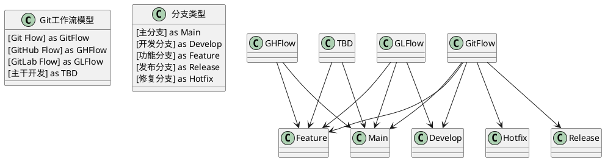

<!-- truncate -->

# Git 工作流与分支策略详解



随着团队规模的扩大和项目复杂度的提高，仅仅使用 Git 的基本命令已不足以应对高效的团队协作需求。设计良好的工作流程和分支策略不仅可以提高团队的生产力，还能减少错误和冲突，确保代码质量。本文将详细介绍几种主流的 Git 工作流模型和分支策略，帮助你为项目选择最合适的方案。

## 理解分支策略的重要性

在开始之前，让我们理解为什么分支策略如此重要：

- **协作效率**：清晰的分支模型使团队成员能够并行工作而不相互干扰
- **代码质量**：通过隔离变更和代码审查，确保主要分支的代码质量
- **发布管理**：有效管理不同版本的发布和维护
- **问题隔离**：当问题出现时，可以轻松定位和隔离问题
- **持续集成/部署**：支持自动化测试和部署流程

## Git Flow 工作流

Git Flow 是由 Vincent Driessen 在 2010 年提出的一个分支管理模型，它为不同的分支分配明确的角色，并定义分支之间的交互方式。

### Git Flow 的分支结构

Git Flow 包含以下几种类型的分支：

#### 长期分支

- **master/main**：只存储正式发布的版本，每个提交都应该有一个版本标签
- **develop**：作为功能开发的集成分支，包含下一个版本的最新变更

#### 临时分支

- **feature/**：从 develop 分支创建，用于开发新功能，完成后合并回 develop
- **release/**：从 develop 分支创建，用于准备发布，可以进行小的修复，完成后合并到 master 和 develop
- **hotfix/**：从 master 分支创建，用于紧急修复生产环境的问题，完成后合并到 master 和 develop

### Git Flow 工作流程

1. **开发新功能**：

   ```bash
   # 从develop分支创建功能分支
   git checkout develop
   git checkout -b feature/new-feature

   # 开发完成后合并回develop
   git checkout develop
   git merge --no-ff feature/new-feature
   git push origin develop

   # 删除功能分支
   git branch -d feature/new-feature
   ```

2. **准备发布版本**：

   ```bash
   # 从develop分支创建发布分支
   git checkout develop
   git checkout -b release/1.0.0

   # 在发布分支上进行测试和修复

   # 完成发布，合并到master和develop
   git checkout master
   git merge --no-ff release/1.0.0
   git tag -a 1.0.0 -m "Version 1.0.0"

   git checkout develop
   git merge --no-ff release/1.0.0

   # 删除发布分支
   git branch -d release/1.0.0
   ```

3. **紧急修复生产问题**：

   ```bash
   # 从master分支创建hotfix分支
   git checkout master
   git checkout -b hotfix/1.0.1

   # 修复完成后合并到master和develop
   git checkout master
   git merge --no-ff hotfix/1.0.1
   git tag -a 1.0.1 -m "Version 1.0.1"

   git checkout develop
   git merge --no-ff hotfix/1.0.1

   # 删除hotfix分支
   git branch -d hotfix/1.0.1
   ```

### Git Flow 的优势

- 结构清晰，各分支职责明确
- 适合有计划的版本发布
- 支持多个版本的并行维护
- 提供紧急修复的流程

### Git Flow 的劣势

- 相对复杂，需要团队成员都理解整个流程
- 可能过于严格，不适合持续部署的项目
- 过多的分支可能导致合并复杂化

### Git Flow 适用场景

- 有明确发布周期的软件产品
- 需要同时维护多个版本的项目
- 有固定 QA 流程的团队
- 规模较大、成员较多的项目

### Git Flow 工具支持

可以使用 Git Flow 工具简化流程：

```bash
# 安装Git Flow
# 在macOS上
brew install git-flow-avh

# 初始化Git Flow
git flow init

# 开始新功能开发
git flow feature start new-feature
git flow feature finish new-feature

# 开始发布
git flow release start 1.0.0
git flow release finish 1.0.0

# 紧急修复
git flow hotfix start 1.0.1
git flow hotfix finish 1.0.1
```

## GitHub Flow 工作流

GitHub Flow 是 GitHub 提出的一个更简单的工作流模型，它适合持续部署的环境。相比 Git Flow，它大大简化了分支策略。

### GitHub Flow 的分支结构

GitHub Flow 只有两种类型的分支：

- **main/master**：唯一的长期分支，包含稳定且可部署的代码
- **功能分支**：从 main 分支创建，用于开发新功能或修复问题

### GitHub Flow 工作流程

1. **从 main 分支创建功能分支**：

   ```bash
   git checkout main
   git pull
   git checkout -b feature-branch
   ```

2. **在功能分支上进行代码编写和提交**：

   ```bash
   # 编写代码
   git add .
   git commit -m "Add new feature"
   ```

3. **推送功能分支到远程仓库**：

   ```bash
   git push -u origin feature-branch
   ```

4. **创建 Pull Request，进行代码审查**

5. **部署功能分支到测试环境进行验证**

6. **通过 Pull Request 将功能分支合并到 main 分支**

7. **部署 main 分支到生产环境**

8. **删除功能分支**

### GitHub Flow 的优势

- 简单易懂，容易上手
- 适合持续部署的项目
- 强调代码审查和自动化测试
- 每次合并到 main 分支的代码都可以部署

### GitHub Flow 的劣势

- 不支持多版本并行维护
- 没有专门的发布流程
- 对于大型项目可能缺乏足够的结构支持

### GitHub Flow 适用场景

- Web 应用和在线服务
- 采用持续部署策略的团队
- 小型到中型规模的项目
- 具有良好自动化测试覆盖的项目

## GitLab Flow 工作流

GitLab Flow 是 GitLab 提出的一个工作流模型，它结合了 Git Flow 的结构化和 GitHub Flow 的简单性，同时添加了环境分支的概念。

### GitLab Flow 的分支结构

GitLab Flow 包含以下分支：

- **main/master**：包含稳定且可部署的代码
- **功能分支**：从 main 分支创建，用于开发新功能
- **环境分支**（可选）：如 production, staging, pre-production 等，代表不同的部署环境
- **发布分支**（可选）：用于维护已发布的特定版本

### GitLab Flow 工作流程 - 基于环境的变体

1. **从 main 分支创建功能分支**：

   ```bash
   git checkout main
   git pull
   git checkout -b feature-branch
   ```

2. **在功能分支上进行开发**：

   ```bash
   # 编写代码
   git add .
   git commit -m "Add new feature"
   ```

3. **创建 Merge Request（Pull Request）**

4. **代码审查后合并到 main 分支**

5. **自动部署 main 分支到测试环境**

6. **从 main 分支推送到预生产环境分支**：

   ```bash
   git checkout pre-production
   git pull
   git merge --no-ff main
   git push origin pre-production
   ```

7. **从预生产环境分支推送到生产环境分支**：
   ```bash
   git checkout production
   git pull
   git merge --no-ff pre-production
   git push origin production
   ```

### GitLab Flow 工作流程 - 基于发布的变体

这适用于需要维护多个版本的项目：

1. **从 main 分支创建功能分支并开发**

2. **合并功能分支到 main 分支**

3. **从 main 分支创建版本分支**：

   ```bash
   git checkout main
   git checkout -b 1-0-stable
   ```

4. **为版本分支打标签**：

   ```bash
   git tag v1.0.0
   ```

5. **在版本分支上进行 bug 修复**：

   ```bash
   git checkout 1-0-stable
   git checkout -b hotfix-branch
   # 修复bug
   git checkout 1-0-stable
   git merge --no-ff hotfix-branch
   git tag v1.0.1
   ```

6. **将修复同时应用到 main 分支**：
   ```bash
   git checkout main
   git cherry-pick v1.0.1
   ```

### GitLab Flow 的优势

- 结合了 Git Flow 和 GitHub Flow 的优点
- 支持环境部署和版本管理
- 适应性强，可根据项目需求调整
- 支持持续部署和版本发布

### GitLab Flow 的劣势

- 相比 GitHub Flow 更复杂
- 需要团队理解不同环境或版本分支的用途

### GitLab Flow 适用场景

- 需要严格部署流程的项目
- 同时需要持续集成和版本控制的项目
- 有多个部署环境的项目
- 中型到大型项目

## 主干开发模型（Trunk-Based Development）

主干开发是一种更加精简的工作流，开发者直接在主分支（主干）上进行开发，或创建短期的功能分支，快速合并回主干。

### 主干开发的分支结构

- **trunk/main/master**：主干分支，所有开发活动的中心
- **短期功能分支**：从主干创建，生命周期通常不超过一两天
- **发布分支**（可选）：用于发布准备和维护

### 主干开发工作流程

1. **频繁地从主干拉取最新代码**：

   ```bash
   git checkout main
   git pull
   ```

2. **直接在主干上开发，或创建短期分支**：

   ```bash
   # 可选：创建短期功能分支
   git checkout -b feature-small

   # 编写代码
   git add .
   git commit -m "Small change"
   ```

3. **使用功能开关控制未完成功能**：
   在代码中实现功能开关，使未完成的功能在生产环境中保持禁用状态

4. **频繁集成回主干**：

   ```bash
   git checkout main
   git pull
   git merge feature-small
   git push
   ```

5. **创建发布分支（可选）**：
   ```bash
   git checkout main
   git checkout -b release-1.0
   ```

### 主干开发的优势

- 减少长期分支带来的集成问题
- 快速反馈循环
- 促进持续集成和持续部署
- 降低合并冲突的风险和严重性

### 主干开发的劣势

- 需要高度自动化的测试和部署流程
- 对开发者技能要求较高
- 需要功能开关来管理未完成功能
- 可能不适合较大的功能开发

### 主干开发适用场景

- 追求快速迭代的团队
- 有强大自动化测试覆盖的项目
- 采用持续部署的环境
- 经验丰富的开发团队

## 如何选择适合的工作流

选择合适的 Git 工作流应考虑以下因素：

### 项目性质

- **传统软件产品**：有固定发布周期，可能适合 Git Flow
- **Web 应用/在线服务**：需要频繁部署，可能适合 GitHub Flow 或主干开发
- **多环境部署**：需要严格控制部署流程，可能适合 GitLab Flow

### 团队规模和经验

- **小型团队/初创公司**：简单的 GitHub Flow 可能更适合
- **大型团队/复杂项目**：结构化的 Git Flow 或 GitLab Flow 可能更好
- **经验丰富的团队**：可以考虑主干开发

### 发布频率

- **计划性发布（例如每季度）**：适合 Git Flow
- **持续部署（每天多次）**：适合 GitHub Flow 或主干开发
- **混合模式**：考虑 GitLab Flow

### 自动化程度

- **高度自动化（CI/CD）**：可以支持更简单的工作流，如 GitHub Flow 或主干开发
- **手动测试和部署**：可能需要更结构化的流程，如 Git Flow

## 工作流最佳实践

无论选择哪种工作流，以下最佳实践都值得遵循：

### 提交规范

- 使用清晰、统一的提交信息格式
- 每个提交专注于一个变更
- 使用工具如 Commitizen 和 commitlint 强制规范

### 分支命名约定

- 使用一致的前缀：`feature/`, `bugfix/`, `hotfix/`, `release/`等
- 在分支名中包含票务系统 ID：`feature/JIRA-123-add-login`
- 使用短横线分隔词语，避免空格和特殊字符

### 代码审查流程

- 所有代码变更都应经过审查
- 使用 Pull/Merge Request 功能
- 定义明确的审查标准
- 自动化检查（如静态分析、测试覆盖）

### 自动化与集成

- 实现持续集成（CI）流程
- 自动化测试（单元测试、集成测试、E2E 测试）
- 考虑自动部署（CD）
- 使用预提交钩子进行本地检查

### 发布管理

- 使用语义化版本（Semantic Versioning）
- 为每个正式发布创建标签
- 维护变更日志（CHANGELOG）
- 考虑使用发布自动化工具

## 常见问题与解决方案

### 长期分支的集成困难

**问题**：长期存在的功能分支难以与主分支保持同步，导致大量合并冲突。

**解决方案**：

- 定期将主分支合并到功能分支
- 限制功能分支的生命周期
- 考虑使用功能标志（Feature Flags）

### 合并冲突

**问题**：频繁的合并冲突阻碍开发流程。

**解决方案**：

- 细分功能，创建更小的提交
- 团队成员之间更好的沟通和协调
- 避免在同一文件的同一区域同时进行修改

### 发布过程不稳定

**问题**：发布过程中出现意外问题。

**解决方案**：

- 增强自动化测试覆盖
- 实施更严格的代码审查
- 使用预发布环境进行验证
- 实施蓝绿部署或金丝雀发布策略

### 历史记录混乱

**问题**：无法理解仓库的历史状态。

**解决方案**：

- 强制使用有意义的提交信息
- 考虑使用"squash and merge"策略
- 定期整理和记录重要变更

## 案例研究：不同规模团队的工作流

### 小型团队/初创公司

**建议工作流**：简化的 GitHub Flow

**特点**：

- 简单直观，容易实施
- 所有功能分支直接从 main 创建
- 使用 Pull Request 进行代码审查
- 合并后自动部署

### 中型团队/成长期公司

**建议工作流**：GitLab Flow 或轻量级 Git Flow

**特点**：

- 增加环境分支或发布分支
- 更严格的代码审查流程
- 自动化测试和部署
- 更结构化的分支命名和管理

### 大型团队/企业级项目

**建议工作流**：完整的 Git Flow 或定制的企业级工作流

**特点**：

- 完整的分支策略
- 严格的版本控制和发布流程
- 综合的 CI/CD 流水线
- 详细的文档和培训

## 结语

选择合适的 Git 工作流和分支策略对团队协作和项目成功至关重要。没有一种放之四海而皆准的方法，应根据项目和团队的具体情况做出选择。甚至可以随着项目的发展和团队的成长，逐渐调整和优化工作流程。

最重要的是，无论选择哪种工作流，都应确保团队成员理解并一致地遵循它，同时配合良好的自动化测试和持续集成实践。这样才能充分发挥 Git 的强大功能，提高团队协作效率和代码质量。

在基础的[Git 基础教程](/blog/git-basic-guide)和进阶的[Git 高级技巧](/blog/git-advanced-techniques)之上，掌握这些工作流模型将使你能够更有效地管理团队协作和代码版本控制。

## 参考资源

- [Understanding the GitHub Flow](https://guides.github.com/introduction/flow/)
- [GitLab Flow](https://docs.gitlab.com/ee/topics/gitlab_flow.html)
- [A successful Git branching model (Git Flow)](https://nvie.com/posts/a-successful-git-branching-model/)
- [Trunk Based Development](https://trunkbaseddevelopment.com/)
- [GitHub、GitLab 工作流实践](https://www.atlassian.com/git/tutorials/comparing-workflows)
