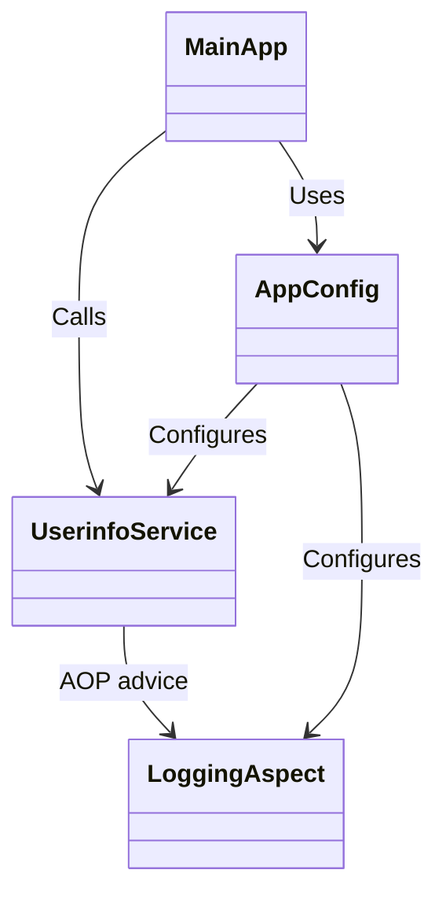
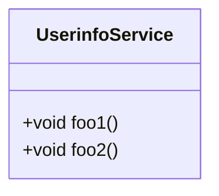
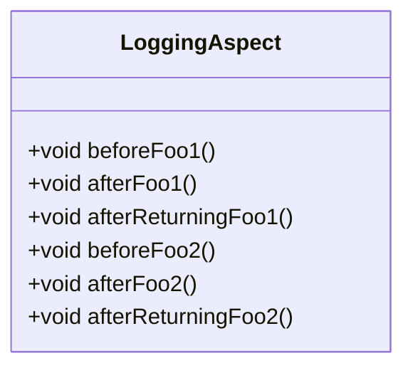
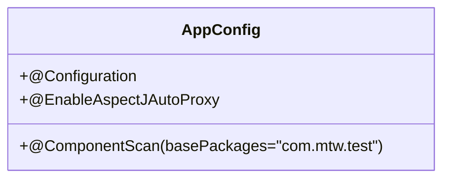
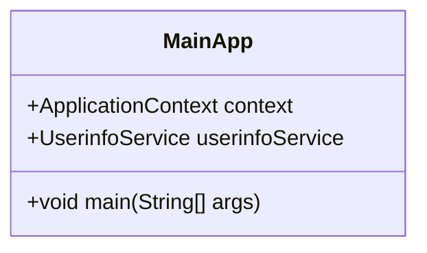
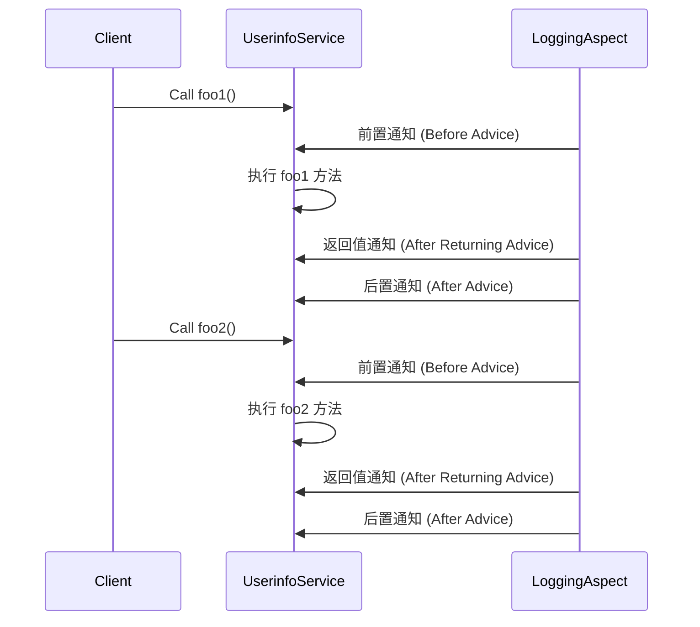

<!-- truncate -->

# spring实现不同通知

## 介绍

这个项目是一个基于 **Spring 框架** 的面向切面编程（AOP）案例，展示了如何通过 AOP 在方法执行的不同阶段（前置、后置、返回值）插入日志记录功能。项目通过实现一个简单的服务类 `UserinfoService`，并利用切面类 `LoggingAspect` 来分别在方法调用前后记录日志信息。




## 解释

`MainApp` 依赖于 `AppConfig` 配置类，获取 `UserinfoService` Bean 并调用方法。

`UserinfoService` 受到 `LoggingAspect` 的 AOP 通知（切面）。

`AppConfig` 配置类配置了 `UserinfoService` 和 `LoggingAspect`。

## 操作

### 1. 创建项目结构

创建 `com.mtw.test` 包，并在该包中添加`Service.UserinfoService` 服务类和 `Aspect.LoggingAspect`切面类。

同样我们需要一个配置类来告诉 Spring 我们的应用有哪些包需要被扫描、哪些功能需要启用，所以创建一个`Config.AppConfig`配置类，以及一个`Test.MainApp`测试类来运行 `UserinfoService` 中的 `foo1` 和 `foo2` 方法，并观察 `LoggingAspect` 的切面通知是否会执行。

| 文件和文件夹结构示例                                         |                                                              |
| ------------------------------------------------------------ | ------------------------------------------------------------ |
| src<br/>└── main<br/>    └── java<br/>        └── com<br/>            └── mtw<br/>                └── test<br/>                    ├── aspect<br/>                    │   └── LoggingAspect.java<br/>                    ├── service<br/>                    │   └── UserinfoService.java<br/>                    ├── config<br/>                    │   └── AppConfig.java<br/>                    └── Test<br/>                        └── MainApp.java |  |

### 2. 定义 `UserinfoService` 类

这是一个业务逻辑类，负责执行核心功能。在这里，我们定义了两个简单的业务方法：

- `foo1()`：打印"foo1被调用"
- `foo2()`：打印"foo2被调用"



```java
package com.mtw.test.Service;

import org.springframework.stereotype.Service;

@Service
public class UserinfoService {

    public void foo1(){
        System.out.println("foo1被调用");
    }

    public void foo2(){
        System.out.println("foo2被调用");
    }

}
```

### 3. 定义切面类 `LoggingAspect`

这是一个切面类，用于实现 AOP（面向切面编程）。切面中定义了多个通知方法，这些方法会在 `foo1()` 和 `foo2()` 执行时被调用，记录不同阶段的日志。

- **前置通知**：方法执行之前触发，记录 "前置通知"。
- **后置通知**：方法执行之后触发，记录 "后置通知"。
- **返回值通知**：方法执行完并返回值之后触发，记录 "返回值通知"。

> [!WARNING]
>
> 要使用 `@Aspect` 注解和 Spring AOP 功能，确保在项目的 `pom.xml` 文件中添加以下 Spring AOP 依赖：
>
> ```xml
> <dependency>
>     <groupId>org.springframework</groupId>
>     <artifactId>spring-aspects</artifactId>
>     <version>5.3.10</version> <!-- 使用适合你的Spring版本 -->
> </dependency>
> ```
>
> 此外，还需要以下依赖，以确保 Spring AOP 能正常工作：
>
> ```xml
> <dependency>
>     <groupId>org.springframework</groupId>
>     <artifactId>spring-context</artifactId>
>     <version>5.3.10</version>
> </dependency>
> <dependency>
>     <groupId>org.springframework</groupId>
>     <artifactId>spring-aop</artifactId>
>     <version>5.3.10</version>
> </dependency>
> ```
>
> 这些依赖项允许项目使用 `@Aspect` 注解并支持面向切面的编程功能。
>
> 




```java
package com.mtw.test.Aspect;

import org.aspectj.lang.annotation.After;
import org.aspectj.lang.annotation.AfterReturning;
import org.aspectj.lang.annotation.Aspect;
import org.aspectj.lang.annotation.Before;
import org.springframework.stereotype.Component;

@Aspect
@Component
public class LoggingAspect {

    @Before("execution(* com.mtw.test.Service.*.*(..))")
    public void beforeAdvice() {
        System.out.println("前置通知");
    }

    @After("execution(* com.mtw.test.Service.*.*(..))")
    public void afterAdvice() {
        System.out.println("后置通知");
    }

    @AfterReturning("execution(* com.mtw.test.Service.*.*(..))")
    public void afterReturningAdvice() {
        System.out.println("返回值通知");
    }

}

```


### 4. 配置 Spring AOP

这个类是 Spring 配置类，配置了 Spring AOP 和组件扫描。通过 `@EnableAspectJAutoProxy` 启用 AOP 功能，并通过 `@ComponentScan` 告诉 Spring 扫描 `com.mtw.test` 包下的所有组件（如 `UserinfoService` 和 `LoggingAspect`）。




```java
package com.mtw.test.Config;

import org.springframework.context.annotation.Configuration;
import org.springframework.context.annotation.ComponentScan;
import org.springframework.context.annotation.EnableAspectJAutoProxy;

@Configuration
@ComponentScan(basePackages = "com.mtw.test")
@EnableAspectJAutoProxy
public class Appconfig {

}

```

### 5. 测试代码

这是一个简单的测试类，负责启动 Spring 容器并调用 `UserinfoService` 中的方法（`foo1()` 和 `foo2()`）。通过运行这个类，你可以验证切面通知是否在方法执行的各个阶段被正确触发。




```java
package com.mtw.test.Test;

import com.mtw.test.Config.Appconfig;
import com.mtw.test.Service.UserinfoService;
import org.springframework.context.ApplicationContext;
import org.springframework.context.annotation.AnnotationConfigApplicationContext;

public class MainApp {
    public static void main(String[] args) {

        ApplicationContext context = new AnnotationConfigApplicationContext(Appconfig.class);
        UserinfoService userinfoService = context.getBean(UserinfoService.class);

        userinfoService.foo1();
        System.out.println("----------");
        userinfoService.foo2();
    }

}
```

### 6. 运行和输出

运行 `MainApp`，控制台输出应如下：

| 运行结果                                                     |                                                              |
| ------------------------------------------------------------ | ------------------------------------------------------------ |
| 前置通知    <br/>foo1被调用 <br/>返回值通知  <br/>后置通知       <br/>----------                   <br/>前置通知    <br/>foo2被调用<br/>返回值通知<br/>后置通知 |  |


### 7. 解释



- **前置通知**：在目标方法执行前触发
- **后置通知**：在目标方法执行后触发，无论是否抛出异常
- **返回值通知**：在目标方法正常执行并返回后触发
