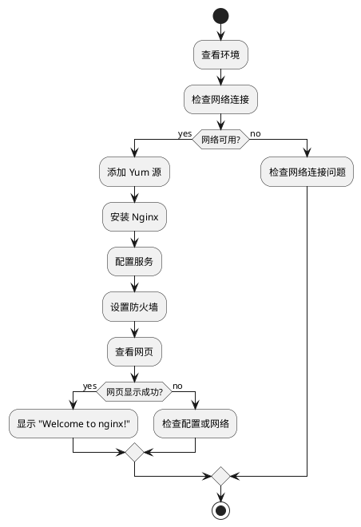

<!-- truncate -->

# Linux 安装配置 Nginx





## 前言

我在下载 `Nginx` 的时候出现报错

```
：No package nginx available.
```

按照网上配置阿里云的教程还有或有错误

```bash
[root@192 ~]# yum install nginx -y Loaded plugins: fastestmirror, langpacks Loading mirror speeds from cached hostfile  * base: mirrors.aliyun.com  * extras: mirrors.aliyun.com  * updates: mirrors.aliyun.com No package nginx available. Error: Nothing
```

经过反复试错后找到此方法


## 步骤

### 查看环境

本人环境

> ```basj
> cat /etc/redhat-release
> ```
>
> 

### 查看网络环境

先检查服务器是否可以连接外网,用百度来举例,若出现一下结果,说明可以连接,可以手动暂停`CTRL + c`

```
ping www.baidu.com
```


### 添加 yum源

如果直接使用 ` yum install nginx -y `,会出现Not Found的情况,所以我们使用 `epel` 或者官网的 `yum`源，本例使用官网的源

```bash
sudo rpm -ivh http://nginx.org/packages/centos/7/noarch/RPMS/nginx-release-centos-7-0.el7.ngx.noarch.rpm
```

安装完成后,可以查看一下

```bash
sudo yum repolist
```


### 安装 `Nginx`

使用命令

```bahs
sudo yum install nginx
```


### 配置 `Nginx`服务

设置开机启动

``` bash
sudo systemctl enable nginx
```

启动服务

``` bash
sudo systemctl start nginx
```

停止服务

``` bash
sudo systemctl start nginx
```

重新加载,重启服务

```bash
sudo systemctl reload nginx
```

启动后查看服务进程

``` bash
ps -ef | grep 'nginx'
```


### 防火墙端口设置

#### 打开防火墙

```bash
sudo firewall-cmd --zone=public --permanent --add-service=http

sudo firewall-cmd --reload

```

出现`success`则表示成功

打开后,可以查看一下防火墙打开的所有的服务

```bash
sudo firewall-cmd --list-service
```


#### 关闭防火墙

```bash
iptables -F
```


### 查看网页

在浏览器输入自己的`IP`,如果看到`Welcome to nginx!`,那么,表示已经成功了


```bash
#查看IP命令
ip addr
```


### 一秒做一个网页

其实就是把别人的网页代码下载下来,拷到我们自己的网页中

#### 步骤

我们以DNF官网为例,首先打开[DNF官网](https://dnf.qq.com/main.shtml)

使用`wget`直接下载网页

```
wget https://dnf.qq.com/main.shtml
```


将文件拷贝到`nginx`网站目录下,他会自动识别

 此时会提示你是否要覆盖,输入y回车即可,无需重启,网站会自动跟新

此时在刷新网站后,可以看到


