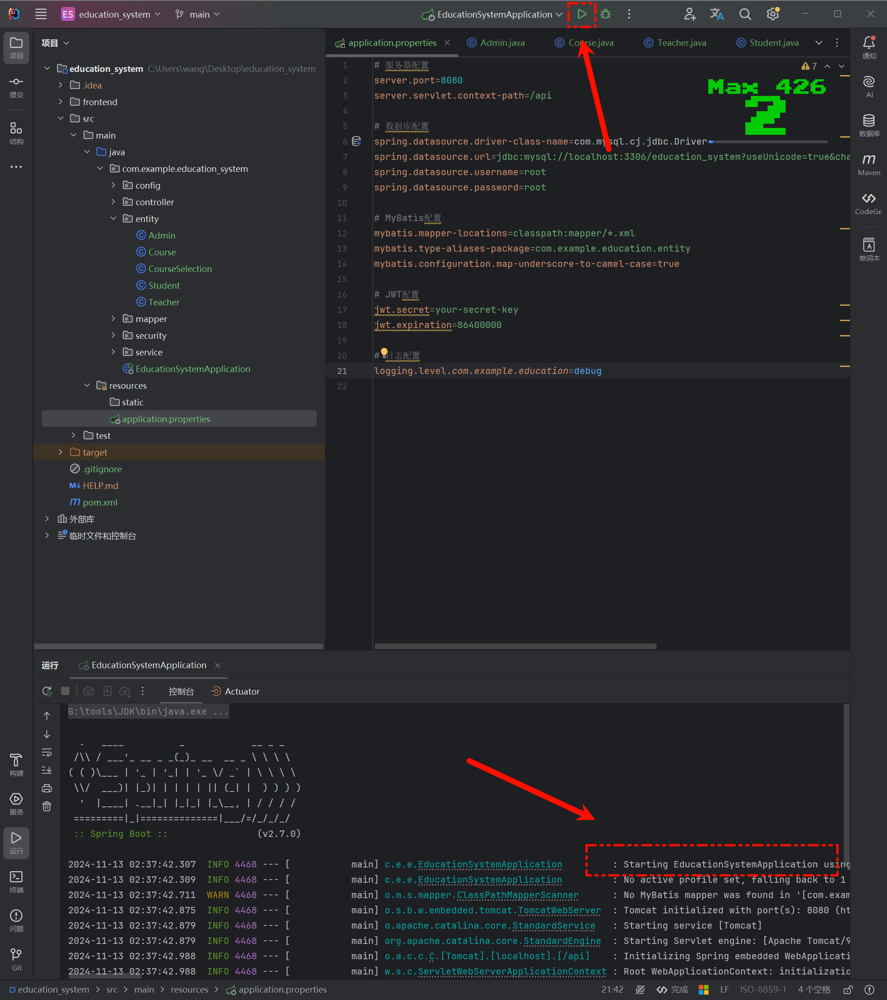

<!-- truncate -->

# AI开发教务管理系统

## 项目背景

本项目是基于SSM框架（Spring+SpringMVC+MyBatis）或SpringBoot的教务信息管理系统，作为课程期末大作业。项目开发过程中，我采用了AI辅助开发的方式，提高开发效率和代码质量。

### 结果

所以，综合来看，最后我选择了Claude，他的回答很符合我的要求，所以用来写Code，ChatGPT交流更顺畅，用来写文档。

## 操作

### 第一步：基础环境搭建

#### 1. 配置开发环境

1. **开发工具**：本篇使用IDEA来开发后端，VSCode来开发前端。
2. **框架选择**：Spring Boot
3. **数据库**：使用MySQL。
4. **服务器**：使用Tomcat（Spring Boot，可以直接内置Tomcat）。

#### 2. 创建项目

##### 后端

- 如果使用的是 Spring Boot，可以通过 Spring Initializr 来生成项目

  - >首先进入[Spring Initializr](https://start.spring.io/),然后按照图上的进行配依赖可以暂时不添如果你想用Java 8 的话还是建议你用IDE来创 

- 如果使用的是 SSM，可以在 IDE 中手动创建项目结构，并添加所需依赖

  - >把服务器URL换成 `https://start.aliyun.com/` 就可以使用Java 8
    >
    >
    >
    >同样的我们这里添加对应的 `Maven` 依赖,这个后续也可以在 `POM` 文件里加也行,之后创建就好
    >
    >

##### 前端

在开始之前，要确保自己有 `node` 和 `Vue` 的环境：

```bash
node -v

npm -version

vue --version
```


有了环境后我们就可以开始创建`Vue`项目。这里我们创建`Vue3`的项目。

首先，我们要以管理员身份运行`cmd`


接着 `cd` 到项目里 

接着我们使用命令`vue create frontend`来创建项目：


这里我们选最后一项：


用空格来控制选择，选择图中内容即可


之后，我们选择`Vue3`

是否要保存为这个项目作为一个模板保存？我们输入`n`，然后回车


看到这个界面，说明我们的项目已经创建成功了，也可以在文件夹中看到，我们创建的项目。可以输入蓝色的命令来启动项目，这里就不演示了。


#### 3. 项目结构

这里我们让AI为我们提供一个完整的教务管理系统项目结构（tree）：

```css
education-system/
├── pom.xml
├── src/
│   ├── main/
│   │   ├── java/
│   │   │   └── com/
│   │   │       └── example/
│   │   │           └── education/
│   │   │               ├── EducationSystemApplication.java
│   │   │               ├── config/
│   │   │               │   ├── SecurityConfig.java
│   │   │               │   ├── JwtAuthenticationEntryPoint.java
│   │   │               │   └── JwtRequestFilter.java
│   │   │               ├── controller/
│   │   │               │   ├── AdminController.java
│   │   │               │   ├── TeacherController.java
│   │   │               │   ├── StudentController.java
│   │   │               │   ├── CourseController.java
│   │   │               │   └── CourseSelectionController.java
│   │   │               ├── entity/
│   │   │               │   ├── Admin.java
│   │   │               │   ├── Teacher.java
│   │   │               │   ├── Student.java
│   │   │               │   ├── Course.java
│   │   │               │   └── CourseSelection.java
│   │   │               ├── mapper/
│   │   │               │   ├── AdminMapper.java
│   │   │               │   ├── TeacherMapper.java
│   │   │               │   ├── StudentMapper.java
│   │   │               │   ├── CourseMapper.java
│   │   │               │   └── CourseSelectionMapper.java
│   │   │               ├── service/
│   │   │               │   ├── AdminService.java
│   │   │               │   ├── TeacherService.java
│   │   │               │   ├── StudentService.java
│   │   │               │   ├── CourseService.java
│   │   │               │   └── CourseSelectionService.java
│   │   │               ├── security/
│   │   │               │   ├── CustomUserDetailsService.java
│   │   │               │   └── JwtUtils.java
│   │   │               └── EducationSystemApplication.java
│   │   └── resources/
│   │       ├── application.properties
│   │       └── mapper/
│   │           ├── AdminMapper.xml
│   │           ├── TeacherMapper.xml
│   │           ├── StudentMapper.xml
│   │           ├── CourseMapper.xml
│   │           └── CourseSelectionMapper.xml
│   └── test/
│       └── java/
│           └── com/
│               └── example/
│                   └── education/
│                       └── EducationSystemApplicationTests.java
└── frontend/
    ├── package.json
    ├── src/
    │   ├── main.js
    │   ├── App.vue
    │   ├── router.js
    │   ├── store.js
    │   ├── components/
    │   │   ├── Navbar.vue
    │   │   ├── AdminDashboard.vue
    │   │   ├── TeacherDashboard.vue
    │   │   ├── StudentDashboard.vue
    │   │   ├── CourseList.vue
    │   │   └── CourseSelection.vue
    │   └── views/
    │       ├── Login.vue
    │       ├── Register.vue
    │       ├── AdminPanel.vue
    │       ├── TeacherPanel.vue
    │       └── StudentPanel.vue
    └── public/
        ├── index.html
        └── favicon.ico
```

那么我们也就照着这个结构来创建文件：

| 前端                                                         | 后端                                                         |
| ------------------------------------------------------------ | ------------------------------------------------------------ |
|  |  |

#### 4. 设计数据库

我们打开 `Navicat` 点击新建查询，然后将代码粘贴，点击运行，刷新后表格就生成好了。

```mysql
-- 创建数据库
CREATE DATABASE IF NOT EXISTS education_system DEFAULT CHARSET utf8mb4;
USE education_system;

-- 管理员表
CREATE TABLE admin (
    id BIGINT PRIMARY KEY AUTO_INCREMENT COMMENT '管理员ID',
    username VARCHAR(50) NOT NULL UNIQUE COMMENT '用户名',
    password VARCHAR(100) NOT NULL COMMENT '密码',
    name VARCHAR(50) NOT NULL COMMENT '姓名',
    phone VARCHAR(20) COMMENT '联系电话',
    email VARCHAR(100) COMMENT '邮箱',
    create_time DATETIME DEFAULT CURRENT_TIMESTAMP COMMENT '创建时间',
    update_time DATETIME DEFAULT CURRENT_TIMESTAMP ON UPDATE CURRENT_TIMESTAMP COMMENT '更新时间'
) COMMENT '管理员表';

-- 教师表
CREATE TABLE teacher (
    id BIGINT PRIMARY KEY AUTO_INCREMENT COMMENT '教师ID',
    username VARCHAR(50) NOT NULL UNIQUE COMMENT '用户名',
    password VARCHAR(100) NOT NULL COMMENT '密码',
    name VARCHAR(50) NOT NULL COMMENT '姓名',
    title VARCHAR(50) COMMENT '职称',
    department VARCHAR(100) COMMENT '所属院系',
    phone VARCHAR(20) COMMENT '联系电话',
    email VARCHAR(100) COMMENT '邮箱',
    create_time DATETIME DEFAULT CURRENT_TIMESTAMP COMMENT '创建时间',
    update_time DATETIME DEFAULT CURRENT_TIMESTAMP ON UPDATE CURRENT_TIMESTAMP COMMENT '更新时间'
) COMMENT '教师表';

-- 学生表
CREATE TABLE student (
    id BIGINT PRIMARY KEY AUTO_INCREMENT COMMENT '学生ID',
    username VARCHAR(50) NOT NULL UNIQUE COMMENT '用户名',
    password VARCHAR(100) NOT NULL COMMENT '密码',
    name VARCHAR(50) NOT NULL COMMENT '姓名',
    student_no VARCHAR(50) NOT NULL UNIQUE COMMENT '学号',
    class_name VARCHAR(100) COMMENT '班级',
    major VARCHAR(100) COMMENT '专业',
    phone VARCHAR(20) COMMENT '联系电话',
    email VARCHAR(100) COMMENT '邮箱',
    create_time DATETIME DEFAULT CURRENT_TIMESTAMP COMMENT '创建时间',
    update_time DATETIME DEFAULT CURRENT_TIMESTAMP ON UPDATE CURRENT_TIMESTAMP COMMENT '更新时间'
) COMMENT '学生表';

-- 课程表
CREATE TABLE course (
    id BIGINT PRIMARY KEY AUTO_INCREMENT COMMENT '课程ID',
    name VARCHAR(100) NOT NULL COMMENT '课程名称',
    code VARCHAR(50) NOT NULL UNIQUE COMMENT '课程代码',
    credit DECIMAL(3,1) NOT NULL COMMENT '学分',
    hours INT NOT NULL COMMENT '课时',
    teacher_id BIGINT NOT NULL COMMENT '授课教师ID',
    max_student INT NOT NULL DEFAULT 100 COMMENT '最大选课人数',
    description TEXT COMMENT '课程描述',
    create_time DATETIME DEFAULT CURRENT_TIMESTAMP COMMENT '创建时间',
    update_time DATETIME DEFAULT CURRENT_TIMESTAMP ON UPDATE CURRENT_TIMESTAMP COMMENT '更新时间',
    FOREIGN KEY (teacher_id) REFERENCES teacher(id)
) COMMENT '课程表';

-- 选课表
CREATE TABLE course_selection (
    id BIGINT PRIMARY KEY AUTO_INCREMENT COMMENT '选课ID',
    student_id BIGINT NOT NULL COMMENT '学生ID',
    course_id BIGINT NOT NULL COMMENT '课程ID',
    score DECIMAL(5,2) COMMENT '成绩',
    select_time DATETIME DEFAULT CURRENT_TIMESTAMP COMMENT '选课时间',
    create_time DATETIME DEFAULT CURRENT_TIMESTAMP COMMENT '创建时间',
    update_time DATETIME DEFAULT CURRENT_TIMESTAMP ON UPDATE CURRENT_TIMESTAMP COMMENT '更新时间',
    FOREIGN KEY (student_id) REFERENCES student(id),
    FOREIGN KEY (course_id) REFERENCES course(id),
    UNIQUE KEY `uk_student_course` (student_id, course_id)
) COMMENT '选课表';

-- 插入测试数据
INSERT INTO admin (username, password, name, phone, email)
VALUES ('admin', '$2a$10$N.zmdr9k7uOCQb376NoUnuTJ8iAt6Z5EHsM8lE9lBOsl7iKTVKIUi', '管理员', '13800138000', 'admin@example.com');

INSERT INTO teacher (username, password, name, title, department, phone, email)
VALUES
('teacher1', '$2a$10$N.zmdr9k7uOCQb376NoUnuTJ8iAt6Z5EHsM8lE9lBOsl7iKTVKIUi', '张老师', '副教授', '计算机系', '13800138001', 'teacher1@example.com'),
('teacher2', '$2a$10$N.zmdr9k7uOCQb376NoUnuTJ8iAt6Z5EHsM8lE9lBOsl7iKTVKIUi', '李老师', '教授', '数学系', '13800138002', 'teacher2@example.com');

INSERT INTO student (username, password, name, student_no, class_name, major, phone, email)
VALUES
('student1', '$2a$10$N.zmdr9k7uOCQb376NoUnuTJ8iAt6Z5EHsM8lE9lBOsl7iKTVKIUi', '王同学', '2021001', '计算机101', '计算机科学与技术', '13800138003', 'student1@example.com'),
('student2', '$2a$10$N.zmdr9k7uOCQb376NoUnuTJ8iAt6Z5EHsM8lE9lBOsl7iKTVKIUi', '刘同学', '2021002', '计算机101', '计算机科学与技术', '13800138004', 'student2@example.com');
```


#### 5. 添加依赖

将依赖添加到 `pom.xml` ,你也可以直接全部复制粘贴

```xml
<?xml version="1.0" encoding="UTF-8"?>
<project xmlns="http://maven.apache.org/POM/4.0.0" xmlns:xsi="http://www.w3.org/2001/XMLSchema-instance"
         xsi:schemaLocation="http://maven.apache.org/POM/4.0.0 https://maven.apache.org/xsd/maven-4.0.0.xsd">
    <modelVersion>4.0.0</modelVersion>
    <groupId>com.example</groupId>
    <artifactId>education_system</artifactId>
    <version>0.0.1-SNAPSHOT</version>
    <name>education_system</name>
    <description>education_system</description>
    <properties>
        <java.version>1.8</java.version>
        <project.build.sourceEncoding>UTF-8</project.build.sourceEncoding>
        <project.reporting.outputEncoding>UTF-8</project.reporting.outputEncoding>
        <spring-boot.version>2.6.13</spring-boot.version>
    </properties>
    <dependencies>
        <dependency>
            <groupId>org.springframework.boot</groupId>
            <artifactId>spring-boot-starter-security</artifactId>
        </dependency>
        <dependency>
            <groupId>org.springframework.boot</groupId>
            <artifactId>spring-boot-starter-validation</artifactId>
        </dependency>
        <dependency>
            <groupId>org.springframework.boot</groupId>
            <artifactId>spring-boot-starter-web</artifactId>
        </dependency>
        <dependency>
            <groupId>org.mybatis.spring.boot</groupId>
            <artifactId>mybatis-spring-boot-starter</artifactId>
            <version>2.2.2</version>
        </dependency>

        <dependency>
            <groupId>com.mysql</groupId>
            <artifactId>mysql-connector-j</artifactId>
            <scope>runtime</scope>
        </dependency>
        <dependency>
            <groupId>org.projectlombok</groupId>
            <artifactId>lombok</artifactId>
            <optional>true</optional>
        </dependency>
        <dependency>
            <groupId>org.springframework.boot</groupId>
            <artifactId>spring-boot-starter-test</artifactId>
            <scope>test</scope>
        </dependency>
        <dependency>
            <groupId>org.springframework.security</groupId>
            <artifactId>spring-security-test</artifactId>
            <scope>test</scope>
        </dependency>
    </dependencies>
    <dependencyManagement>
        <dependencies>
            <dependency>
                <groupId>org.springframework.boot</groupId>
                <artifactId>spring-boot-dependencies</artifactId>
                <version>${spring-boot.version}</version>
                <type>pom</type>
                <scope>import</scope>
            </dependency>
        </dependencies>
    </dependencyManagement>

    <build>
        <plugins>
            <plugin>
                <groupId>org.apache.maven.plugins</groupId>
                <artifactId>maven-compiler-plugin</artifactId>
                <version>3.8.1</version>
                <configuration>
                    <source>1.8</source>
                    <target>1.8</target>
                    <encoding>UTF-8</encoding>
                </configuration>
            </plugin>
            <plugin>
                <groupId>org.springframework.boot</groupId>
                <artifactId>spring-boot-maven-plugin</artifactId>
                <version>${spring-boot.version}</version>
                <configuration>
                    <mainClass>com.example.education_system.EducationSystemApplication</mainClass>
                    <skip>true</skip>
                </configuration>
                <executions>
                    <execution>
                        <id>repackage</id>
                        <goals>
                            <goal>repackage</goal>
                        </goals>
                    </execution>
                </executions>
            </plugin>
        </plugins>
    </build>

</project>
```

添加完成后，记得更新


#### 6. 配置Spring boot文件

我们找到 `application.properties` 文件,配置Spring boot

```properties
# 服务器配│
server.port=8080
server.servlet.context-path=/api

# 数据库配│
spring.datasource.driver-class-name=com.mysql.cj.jdbc.Driver
spring.datasource.url=jdbc:mysql://localhost:3306/education_system?useUnicode=true&characterEncoding=utf-8&serverTimezone=Asia/Shanghai
spring.datasource.username=root
spring.datasource.password=root

# MyBatis配置
mybatis.mapper-locations=classpath:mapper/*.xml
mybatis.type-aliases-package=com.example.education.entity
mybatis.configuration.map-underscore-to-camel-case=true

# JWT配置
jwt.secret=your-secret-key
jwt.expiration=86400000

# 日志配置
logging.level.com.example.education=debug
```

配置好后，我们就可以启动了，这样表示启动成功


#### 7. 实体类

让我们从实体类开始。

这里我们定义了管理员、教师、学生、课程和选课信息的实体类。使用了Lombok注解来简化代码。

报错的代码我们需要导入类。快捷键是 `ALT` + `Enter`

```java
// Admin.java
@Data
@Builder
@NoArgsConstructor
@AllArgsConstructor
public class Admin {
    private Long id;
    private String username;
    private String password;
    private String name;
    private String phone;
    private String email;
    private Date createTime;
    private Date updateTime;
}

// Teacher.java
@Data
@Builder
@NoArgsConstructor
@AllArgsConstructor
public class Teacher {
    private Long id;
    private String username;
    private String password;
    private String name;
    private String title;
    private String department;
    private String phone;
    private String email;
    private Date createTime;
    private Date updateTime;
}

// Student.java
@Data
@Builder
@NoArgsConstructor
@AllArgsConstructor
public class Student {
    private Long id;
    private String username;
    private String password;
    private String name;
    private String studentNo;
    private String className;
    private String major;
    private String phone;
    private String email;
    private Date createTime;
    private Date updateTime;
}

// Course.java
@Data
@Builder
@NoArgsConstructor
@AllArgsConstructor
public class Course {
    private Long id;
    private String name;
    private String code;
    private BigDecimal credit;
    private Integer hours;
    private Long teacherId;
    private Integer maxStudent;
    private String description;
    private Date createTime;
    private Date updateTime;
}

// CourseSelection.java
@Data
@Builder
@NoArgsConstructor
@AllArgsConstructor
public class CourseSelection {
    private Long id;
    private Long studentId;
    private Long courseId;
    private BigDecimal score;
    private Date selectTime;
    private Date createTime;
    private Date updateTime;
}
```

接下来我们来实现数据访问层

#### 8. Mapper接口

接下来我们来实现数据访问层

这里定义了各个实体的Mapper接口,包括增删改查等基本操作

```java
// AdminMapper.java
@Mapper
public interface AdminMapper {
    Admin getAdminByUsername(String username);
    int insertAdmin(Admin admin);
    int updateAdmin(Admin admin);
    int deleteAdminById(Long id);
}

// TeacherMapper.java
@Mapper
public interface TeacherMapper {
    Teacher getTeacherByUsername(String username);
    List<Teacher> listTeachers();
    int insertTeacher(Teacher teacher);
    int updateTeacher(Teacher teacher);
    int deleteTeacherById(Long id);
}

// StudentMapper.java
@Mapper
public interface StudentMapper {
    Student getStudentByUsername(String username);
    Student getStudentByStudentNo(String studentNo);
    List<Student> listStudents();
    int insertStudent(Student student);
    int updateStudent(Student student);
    int deleteStudentById(Long id);
}

// CourseMapper.java
@Mapper
public interface CourseMapper {
    Course getCourseById(Long id);
    List<Course> listCourses();
    int insertCourse(Course course);
    int updateCourse(Course course);
    int deleteCourseById(Long id);
}

// CourseSelectionMapper.java
@Mapper
public interface CourseSelectionMapper {
    CourseSelection getCourseSelectionById(Long id);
    List<CourseSelection> listCourseSelectionsByStudentId(Long studentId);
    List<CourseSelection> listCourseSelectionsByCourseId(Long courseId);
    int insertCourseSelection(CourseSelection courseSelection);
    int updateCourseSelection(CourseSelection courseSelection);
    int deleteCourseSelectionById(Long id);
}
```

#### 9. Service实现

接下来我们实现服务层的逻辑，在服务层中实现各个实体的CRUD操作和业务逻辑处理：

```Java
// AdminService.java
@Service
@Transactional
public class AdminService {
    @Autowired
    private AdminMapper adminMapper;

    @Autowired
    private PasswordEncoder passwordEncoder;

    public Admin getAdminByUsername(String username) {
        return adminMapper.getAdminByUsername(username);
    }

    public List<Admin> listAdmins() {
        return adminMapper.listAdmins();
    }

    public int createAdmin(Admin admin) {
        // 对密码进行加密
        admin.setPassword(passwordEncoder.encode(admin.getPassword()));
        return adminMapper.insertAdmin(admin);
    }

    public int updateAdmin(Admin admin) {
        // 如果密码不为空，则进行加密
        if (StringUtils.hasText(admin.getPassword())) {
            admin.setPassword(passwordEncoder.encode(admin.getPassword()));
        }
        return adminMapper.updateAdmin(admin);
    }

    public int deleteAdmin(Long id) {
        return adminMapper.deleteAdminById(id);
    }
}

// StudentService.java
@Service
@Transactional
public class StudentService {
    @Autowired
    private StudentMapper studentMapper;

    @Autowired
    private PasswordEncoder passwordEncoder;

    @Autowired
    private CourseSelectionMapper courseSelectionMapper;

    public Student getStudentByUsername(String username) {
        return studentMapper.getStudentByUsername(username);
    }

    public List<Student> listStudents() {
        return studentMapper.listStudents();
    }

    public int createStudent(Student student) {
        student.setPassword(passwordEncoder.encode(student.getPassword()));
        return studentMapper.insertStudent(student);
    }

    public int updateStudent(Student student) {
        if (StringUtils.hasText(student.getPassword())) {
            student.setPassword(passwordEncoder.encode(student.getPassword()));
        }
        return studentMapper.updateStudent(student);
    }

    public int deleteStudent(Long id) {
        return studentMapper.deleteStudentById(id);
    }

    // 选课业务逻辑
    public int selectCourse(Long studentId, Long courseId) {
        // 检查是否已经选过该课程
        List<CourseSelection> selections = courseSelectionMapper.listCourseSelectionsByStudentId(studentId);
        for (CourseSelection selection : selections) {
            if (selection.getCourseId().equals(courseId)) {
                throw new RuntimeException("已经选过该课程");
            }
        }

        // 创建选课记录
        CourseSelection courseSelection = new CourseSelection();
        courseSelection.setStudentId(studentId);
        courseSelection.setCourseId(courseId);
        return courseSelectionMapper.insertCourseSelection(courseSelection);
    }
}
```

#### 10. Controller实现

控制器层负责处理HTTP请求，实现RESTful API接口：

```java
// AdminController.java
@RestController
@RequestMapping("/admin")
public class AdminController {
    @Autowired
    private AdminService adminService;

    @GetMapping("/list")
    public ResponseEntity<List<Admin>> listAdmins() {
        return ResponseEntity.ok(adminService.listAdmins());
    }

    @PostMapping("/create")
    public ResponseEntity<String> createAdmin(@RequestBody Admin admin) {
        int result = adminService.createAdmin(admin);
        return result > 0 ?
            ResponseEntity.ok("管理员创建成功") :
            ResponseEntity.badRequest().body("管理员创建失败");
    }

    @PutMapping("/update")
    public ResponseEntity<String> updateAdmin(@RequestBody Admin admin) {
        int result = adminService.updateAdmin(admin);
        return result > 0 ?
            ResponseEntity.ok("管理员更新成功") :
            ResponseEntity.badRequest().body("管理员更新失败");
    }

    @DeleteMapping("/delete/{id}")
    public ResponseEntity<String> deleteAdmin(@PathVariable Long id) {
        int result = adminService.deleteAdmin(id);
        return result > 0 ?
            ResponseEntity.ok("管理员删除成功") :
            ResponseEntity.badRequest().body("管理员删除失败");
    }
}

// StudentController.java
@RestController
@RequestMapping("/student")
public class StudentController {
    @Autowired
    private StudentService studentService;

    @GetMapping("/list")
    public ResponseEntity<List<Student>> listStudents() {
        return ResponseEntity.ok(studentService.listStudents());
    }

    @PostMapping("/create")
    public ResponseEntity<String> createStudent(@RequestBody Student student) {
        int result = studentService.createStudent(student);
        return result > 0 ?
            ResponseEntity.ok("学生创建成功") :
            ResponseEntity.badRequest().body("学生创建失败");
    }

    @PutMapping("/update")
    public ResponseEntity<String> updateStudent(@RequestBody Student student) {
        int result = studentService.updateStudent(student);
        return result > 0 ?
            ResponseEntity.ok("学生更新成功") :
            ResponseEntity.badRequest().body("学生更新失败");
    }

    @DeleteMapping("/delete/{id}")
    public ResponseEntity<String> deleteStudent(@PathVariable Long id) {
        int result = studentService.deleteStudent(id);
        return result > 0 ?
            ResponseEntity.ok("学生删除成功") :
            ResponseEntity.badRequest().body("学生删除失败");
    }

    @PostMapping("/select-course")
    public ResponseEntity<String> selectCourse(@RequestParam Long studentId, @RequestParam Long courseId) {
        try {
            int result = studentService.selectCourse(studentId, courseId);
            return result > 0 ?
                ResponseEntity.ok("选课成功") :
                ResponseEntity.badRequest().body("选课失败");
        } catch (Exception e) {
            return ResponseEntity.badRequest().body(e.getMessage());
        }
    }
}
```

#### 11. 安全配置

实现Spring Security配置，处理用户认证和授权：

```java
@Configuration
@EnableWebSecurity
public class SecurityConfig extends WebSecurityConfigurerAdapter {

    @Autowired
    private CustomUserDetailsService userDetailsService;

    @Autowired
    private JwtAuthenticationEntryPoint jwtAuthenticationEntryPoint;

    @Autowired
    private JwtRequestFilter jwtRequestFilter;

    @Override
    protected void configure(AuthenticationManagerBuilder auth) throws Exception {
        auth.userDetailsService(userDetailsService).passwordEncoder(passwordEncoder());
    }

    @Bean
    public PasswordEncoder passwordEncoder() {
        return new BCryptPasswordEncoder();
    }

    @Bean
    @Override
    public AuthenticationManager authenticationManagerBean() throws Exception {
        return super.authenticationManagerBean();
    }

    @Override
    protected void configure(HttpSecurity http) throws Exception {
        http.csrf().disable()
            .authorizeRequests()
            .antMatchers("/api/auth/**").permitAll()
            .antMatchers("/api/admin/**").hasRole("ADMIN")
            .antMatchers("/api/teacher/**").hasRole("TEACHER")
            .antMatchers("/api/student/**").hasRole("STUDENT")
            .anyRequest().authenticated()
            .and()
            .exceptionHandling().authenticationEntryPoint(jwtAuthenticationEntryPoint)
            .and()
            .sessionManagement().sessionCreationPolicy(SessionCreationPolicy.STATELESS);

        http.addFilterBefore(jwtRequestFilter, UsernamePasswordAuthenticationFilter.class);
    }
}
```

#### 12. 前端实现

前端使用Vue3框架实现，下面是一些关键组件的实现：

##### 登录组件

```vue
<!-- Login.vue -->
<template>
  <div class="login-container">
    <div class="login-form">
      <h2>教务管理系统登录</h2>
      <el-form :model="loginForm" :rules="rules" ref="loginFormRef">
        <el-form-item prop="username">
          <el-input v-model="loginForm.username" placeholder="用户名" prefix-icon="el-icon-user"></el-input>
        </el-form-item>
        <el-form-item prop="password">
          <el-input v-model="loginForm.password" type="password" placeholder="密码" prefix-icon="el-icon-lock"></el-input>
        </el-form-item>
        <el-form-item prop="role">
          <el-select v-model="loginForm.role" placeholder="请选择角色" style="width: 100%">
            <el-option label="管理员" value="admin"></el-option>
            <el-option label="教师" value="teacher"></el-option>
            <el-option label="学生" value="student"></el-option>
          </el-select>
        </el-form-item>
        <el-form-item>
          <el-button type="primary" @click="handleLogin" style="width: 100%">登录</el-button>
        </el-form-item>
      </el-form>
    </div>
  </div>
</template>

<script>
import { reactive, ref } from 'vue'
import { useRouter } from 'vue-router'
import { ElMessage } from 'element-plus'
import axios from 'axios'

export default {
  name: 'Login',
  setup() {
    const router = useRouter()
    const loginFormRef = ref(null)

    const loginForm = reactive({
      username: '',
      password: '',
      role: ''
    })

    const rules = {
      username: [{ required: true, message: '请输入用户名', trigger: 'blur' }],
      password: [{ required: true, message: '请输入密码', trigger: 'blur' }],
      role: [{ required: true, message: '请选择角色', trigger: 'change' }]
    }

    const handleLogin = () => {
      loginFormRef.value.validate(async (valid) => {
        if (valid) {
          try {
            const response = await axios.post('/api/auth/login', loginForm)
            localStorage.setItem('token', response.data.token)
            localStorage.setItem('role', loginForm.role)

            ElMessage.success('登录成功')

            // 根据角色跳转到不同的页面
            if (loginForm.role === 'admin') {
              router.push('/admin')
            } else if (loginForm.role === 'teacher') {
              router.push('/teacher')
            } else {
              router.push('/student')
            }
          } catch (error) {
            ElMessage.error('登录失败：' + (error.response?.data?.message || '未知错误'))
          }
        }
      })
    }

    return {
      loginForm,
      loginFormRef,
      rules,
      handleLogin
    }
  }
}
</script>

<style scoped>
.login-container {
  display: flex;
  justify-content: center;
  align-items: center;
  height: 100vh;
  background-color: #f5f7fa;
}

.login-form {
  width: 400px;
  padding: 30px;
  background-color: white;
  border-radius: 8px;
  box-shadow: 0 2px 12px 0 rgba(0, 0, 0, 0.1);
}

h2 {
  text-align: center;
  margin-bottom: 30px;
  color: #409EFF;
}
</style>
```

##### 学生管理组件

```vue
<!-- AdminDashboard.vue -->
<template>
  <div class="admin-dashboard">
    <el-card class="box-card">
      <template #header>
        <div class="card-header">
          <span>学生管理</span>
          <el-button type="primary" @click="handleAddStudent">添加学生</el-button>
        </div>
      </template>

      <el-table :data="students" style="width: 100%" border>
        <el-table-column prop="id" label="ID" width="80"></el-table-column>
        <el-table-column prop="username" label="用户名" width="120"></el-table-column>
        <el-table-column prop="name" label="姓名" width="120"></el-table-column>
        <el-table-column prop="studentNo" label="学号" width="120"></el-table-column>
        <el-table-column prop="className" label="班级" width="120"></el-table-column>
        <el-table-column prop="major" label="专业" width="150"></el-table-column>
        <el-table-column prop="phone" label="联系电话" width="150"></el-table-column>
        <el-table-column prop="email" label="邮箱" width="180"></el-table-column>
        <el-table-column label="操作" width="180">
          <template #default="scope">
            <el-button size="small" @click="handleEditStudent(scope.row)">编辑</el-button>
            <el-button size="small" type="danger" @click="handleDeleteStudent(scope.row)">删除</el-button>
          </template>
        </el-table-column>
      </el-table>
    </el-card>

    <!-- 添加/编辑学生对话框 -->
    <el-dialog :title="dialogTitle" v-model="dialogVisible" width="500px">
      <el-form :model="studentForm" :rules="rules" ref="studentFormRef" label-width="100px">
        <el-form-item label="用户名" prop="username">
          <el-input v-model="studentForm.username"></el-input>
        </el-form-item>
        <el-form-item label="密码" prop="password" v-if="isAdd">
          <el-input v-model="studentForm.password" type="password"></el-input>
        </el-form-item>
        <el-form-item label="姓名" prop="name">
          <el-input v-model="studentForm.name"></el-input>
        </el-form-item>
        <el-form-item label="学号" prop="studentNo">
          <el-input v-model="studentForm.studentNo"></el-input>
        </el-form-item>
        <el-form-item label="班级" prop="className">
          <el-input v-model="studentForm.className"></el-input>
        </el-form-item>
        <el-form-item label="专业" prop="major">
          <el-input v-model="studentForm.major"></el-input>
        </el-form-item>
        <el-form-item label="联系电话" prop="phone">
          <el-input v-model="studentForm.phone"></el-input>
        </el-form-item>
        <el-form-item label="邮箱" prop="email">
          <el-input v-model="studentForm.email"></el-input>
        </el-form-item>
      </el-form>
      <template #footer>
        <span class="dialog-footer">
          <el-button @click="dialogVisible = false">取消</el-button>
          <el-button type="primary" @click="submitForm">确定</el-button>
        </span>
      </template>
    </el-dialog>
  </div>
</template>

<script>
import { ref, reactive, onMounted } from 'vue'
import { ElMessage, ElMessageBox } from 'element-plus'
import axios from 'axios'

export default {
  name: 'AdminDashboard',
  setup() {
    const students = ref([])
    const dialogVisible = ref(false)
    const dialogTitle = ref('')
    const isAdd = ref(true)
    const studentFormRef = ref(null)

    const studentForm = reactive({
      id: null,
      username: '',
      password: '',
      name: '',
      studentNo: '',
      className: '',
      major: '',
      phone: '',
      email: ''
    })

    const rules = {
      username: [{ required: true, message: '请输入用户名', trigger: 'blur' }],
      password: [{ required: true, message: '请输入密码', trigger: 'blur' }],
      name: [{ required: true, message: '请输入姓名', trigger: 'blur' }],
      studentNo: [{ required: true, message: '请输入学号', trigger: 'blur' }]
    }

    // 获取学生列表
    const fetchStudents = async () => {
      try {
        const response = await axios.get('/api/student/list', {
          headers: { Authorization: `Bearer ${localStorage.getItem('token')}` }
        })
        students.value = response.data
      } catch (error) {
        ElMessage.error('获取学生列表失败')
      }
    }

    // 添加学生
    const handleAddStudent = () => {
      isAdd.value = true
      dialogTitle.value = '添加学生'
      Object.keys(studentForm).forEach(key => {
        studentForm[key] = ''
      })
      studentForm.id = null
      dialogVisible.value = true
    }

    // 编辑学生
    const handleEditStudent = (row) => {
      isAdd.value = false
      dialogTitle.value = '编辑学生'
      Object.keys(studentForm).forEach(key => {
        studentForm[key] = row[key]
      })
      studentForm.password = '' // 不回显密码
      dialogVisible.value = true
    }

    // 删除学生
    const handleDeleteStudent = (row) => {
      ElMessageBox.confirm('确定要删除该学生吗？', '提示', {
        confirmButtonText: '确定',
        cancelButtonText: '取消',
        type: 'warning'
      }).then(async () => {
        try {
          await axios.delete(`/api/student/delete/${row.id}`, {
            headers: { Authorization: `Bearer ${localStorage.getItem('token')}` }
          })
          ElMessage.success('删除成功')
          fetchStudents()
        } catch (error) {
          ElMessage.error('删除失败')
        }
      }).catch(() => {})
    }

    // 提交表单
    const submitForm = () => {
      studentFormRef.value.validate(async (valid) => {
        if (valid) {
          try {
            if (isAdd.value) {
              await axios.post('/api/student/create', studentForm, {
                headers: { Authorization: `Bearer ${localStorage.getItem('token')}` }
              })
              ElMessage.success('添加成功')
            } else {
              await axios.put('/api/student/update', studentForm, {
                headers: { Authorization: `Bearer ${localStorage.getItem('token')}` }
              })
              ElMessage.success('更新成功')
            }
            dialogVisible.value = false
            fetchStudents()
          } catch (error) {
            ElMessage.error(isAdd.value ? '添加失败' : '更新失败')
          }
        }
      })
    }

    onMounted(() => {
      fetchStudents()
    })

    return {
      students,
      dialogVisible,
      dialogTitle,
      isAdd,
      studentForm,
      studentFormRef,
      rules,
      handleAddStudent,
      handleEditStudent,
      handleDeleteStudent,
      submitForm
    }
  }
}
</script>

<style scoped>
.admin-dashboard {
  padding: 20px;
}

.card-header {
  display: flex;
  justify-content: space-between;
  align-items: center;
}
</style>
```

### 系统界面展示

#### 登录界面


#### 管理员界面 - 学生管理


#### 管理员界面 - 课程管理


#### 教师界面 - 成绩管理


#### 学生界面 - 选课


## 项目总结

### 技术亮点

1. **前后端分离架构**：采用Spring Boot + Vue3的前后端分离架构，提高了开发效率和系统可维护性。
2. **RESTful API设计**：遵循RESTful设计规范，接口清晰易用。
3. **安全认证**：使用JWT实现无状态的用户认证，提高系统安全性。
4. **数据库设计**：遵循第三范式，合理设计表结构和关系，保证数据完整性。
5. **响应式UI**：使用Element Plus组件库，实现响应式界面，提升用户体验。

### 开发过程中的挑战与解决方案

1. **权限控制**：不同角色（管理员、教师、学生）需要不同的权限。解决方案是使用Spring Security结合JWT实现基于角色的权限控制。
2. **数据关联**：选课表与学生表、课程表的关联关系处理。解决方案是使用外键约束和联合唯一索引确保数据一致性。
3. **前端状态管理**：用户登录状态和权限信息的管理。解决方案是使用Vuex进行集中式状态管理，结合本地存储实现持久化。

### AI辅助开发的经验

1. **代码生成**：使用Claude生成基础代码框架，大大提高了开发效率。
2. **问题解决**：遇到技术难题时，ChatGPT能够提供多种解决方案和思路。
3. **文档编写**：AI工具帮助编写和优化项目文档，使文档更加专业和完整。
4. **最佳实践**：AI工具提供了大量的最佳实践和设计模式建议，提高了代码质量。

### 未来改进方向

1. **功能扩展**：
   - 添加考勤管理功能
   - 实现在线考试系统
   - 增加教学评价功能

2. **技术优化**：
   - 引入Redis缓存提高系统性能
   - 实现分布式部署支持高并发
   - 添加日志监控和系统告警功能

3. **用户体验提升**：
   - 优化移动端适配
   - 增加数据可视化展示
   - 实现消息通知功能

## 结语

通过本次教务管理系统的开发，我不仅掌握了Spring Boot和Vue3的开发技能，还学习了如何利用AI工具提高开发效率。AI辅助开发已经成为现代软件工程中不可或缺的一部分，它不仅能够加速开发过程，还能提供更多创新的解决方案。

在未来的项目中，我将继续探索AI辅助开发的更多可能性，并将这些经验应用到更复杂的系统开发中。
