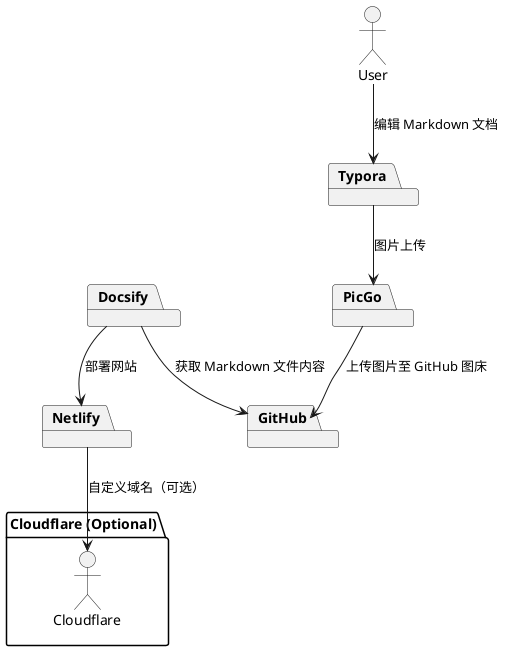

<!-- truncate -->

# 使用 Typora 和 PicGo 配置 GitHub 图床

## 背景

​	很多个人网站是在netlify上host的，通过github直接把网站代码自动导入到netlify上进行编译和发布，实现自动化内容发布。而Netlify的免费版本只提供一个`[site_name].netlify.app`的二级域名，其中site_name可以任意选择，只要未重名就可以。今天这篇文章是介绍如何把自有域名绑定到netlify到网站里，以及实现图床的上传。

## 准备工具

- Typora

- PicGo

- GitHub

## Typora

> **Typora**是一款由Abner Lee开发的轻量级Markdown编辑器与其他Markdown编辑器不同的是，Typora没有采用源代码和预览双栏显示的方式，而是采用所见即所得的编辑方式，实现了即时预览的功能，但也可切换至源代码编辑模式。

### 下载Typora

> [!NOTE]
>
> 我使用的 Typora 版本是 1.9.5，下载后可享受 15 天的免费试用。

- [Typora 官方网站](https://typora.io/)

- [Typora 官方中文站 ](https://typoraio.cn/)

### 设置Typora

​	为了更好地使用 Typora，我们还需要对其进行一些相应的设置

​	在 Markdown 中，插入图片的格式一般为 ``。为了方便管理图片，我们可以先将图片保存到本地。在 Typora 中，可以通过以下步骤进行设置：依次点击 '文件' -> '偏好设置' -> '图像'，选择'复制图片到 ./assets 文件夹'，这样图片就会自动保存到当前文件夹下的 ./assets 目录中。

​	如果你只是需要一个本地知识库，Typora 已经完全能满足你的需求，下面的内容可以忽略。

​	但是，如果你希望将知识库部署到线上，那么你将面临一个问题：图片应该放在哪里？这时，图床可能是一个不错的选择。

## 图床

​	当图片量增大时，网络上的图片通常通过 URL 直接引用，这意味着它们存储在服务器上。图床就是专门用于存储图片的工具，但市面上有很多选择，该如何决定呢？

​	经过综合对比，我最终选择了 **GitHub 图床**，尽管国内访问稍慢，但通过镜像加速后依然是最适合我的免费选择。

### Github

#### 创建仓库

​	在使用 GitHub 图床之前，我们需要先在 GitHub 上创建一个仓库存储图片，以便进行图片的上传和下载操作。

​	首先，登录或注册 GitHub 账户。在右上角点击加号，选择 "New repository"。

​	接下来，输入仓库名称，我这里使用 "Imag" 作为名字。Description（可选）栏可以填写仓库的描述，如果不需要可以跳过。然后选择 "Public" 作为仓库的可见性。根据需要，决定是否添加 README 文件，这里我不添加。最后，点击 "Create repository" 即可完成创建。

#### 获取 设定 Token

​	在 GitHub 主页依次点击`Settings`-> 滑到最下方选择`Developer settings`

​	依次选择`Personal access tokens`->`Tokens (classic)`，然后点击`Generate new token`。

​	填写名称，这里我用Image，更具需求选择时效,我这里选最长的过期时间（可以选择永久），在`Select scopes`中勾选`repo`

​	最后翻到页面最下面，点击`Generate token`生成一个新的 Token。

​	Token 只会显示一次，记得要保存下来，

​	至此，GitHub 的配置就完成了。接下来，我们将开始配置 PicGo。

------

### Pic Go

#### 下载Pic GO

首先我们要下载PicGo

> [!NOTE]
>
> 我使用的 Pic Go 版本是 2.3.0-beta.8。

-  [国内镜像](https://gitcode.com/gh_mirrors/pi/PicGo/PicGo/tags?presetConfig={"tags":59,"release":0})
-  [GitHUb仓库](https://github.com/Molunerfinn/PicGo/releases)

#### 设置Pic GO

​	打开 PicGo，依次选择 "图床设置" -> "GitHub"，然后点击 "设为默认图床" 按钮。

​	点击右上角的编辑按钮

然后填写内容

> - **图床配置名**	       自己去一个合适的名字
> - **设定仓库名**               用户名/仓库名
> - **设定分支**                   main(如果不行就试试master)
> - **设定存储路径**           可以不填,填了会在你项目下创建一个文件夹，图片将会储存在此文件夹中
> - **设定自定义域名**        可以不填,但国内访问GitHub速度会很慢,这里有两种加速方式
>   - **使用 jsDelivr 加速**：设置为 `https://cdn.jsdelivr.net/gh/用户名/项目名`。上传完毕后，通过 `https://cdn.jsdelivr.net/gh/用户名/项目名/图片名` 访问图片。
>   - **使用镜像加速**：设置为 `https://mirror.ghproxy.com/https://raw.githubusercontent.com/用户名/项目名/master/`。

​	最后，点击"确认"按钮即可保存设置。保存后，进入上传区，选择 GitHub 图床并上传一张图片进行测试。如果进度条显示红色，表示上传失败；蓝色则表示上传成功。

​	上传完成后，您可以在 "相册" 中查看刚刚上传的图片。同样，点击编辑按钮即可查看上传地址，这个地址就是图片在 GitHub 仓库中的路径。

​	此外，您也可以在 GitHub 仓库中找到这张图片。

####  将PicGo 集成到 Typora

​	PicGo 图床设置完成后，我们还需要在 Typora 中进行配置。依次点击 **文件** -> **偏好设置** -> **图像**，在页面底部找到 **上传服务设定**，选择 `PicGo(app)`，并设置为你的 PicGo 安装路径。最后，点击 **验证图片上传选项**，确保上传功能正常。

​	如果出现以下错误，说明你的 PicGo 路径填写有误：

​	此时，只需将路径填写正确：

​	然后再次点击 **验证图片上传选项** 进行测试。如下图所示，验证成功：

​	现在，每次在文档中插入图片时，Typora 会自动将图片上传到图床，并返回一个 URL 插入到文档中，十分方便。

​		你也可以通过右键选择 **上传图片**。

​	此外，还可以在文档中依次选择 **格式** -> **图像** -> **上传所有本地图片**，一键上传文档中的所有图片到图床。

​	至此，你的本地知识库基本搭建完成，后续添加内容将变得非常简单和轻松。
