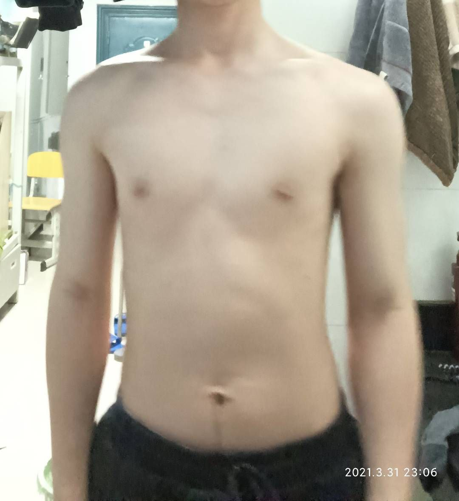
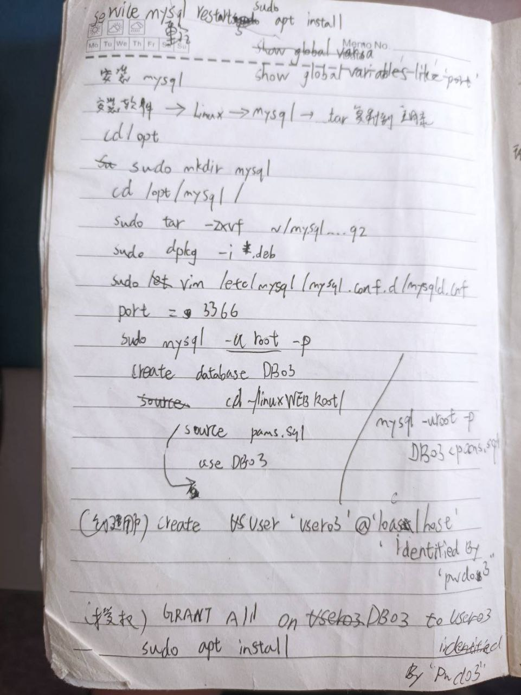
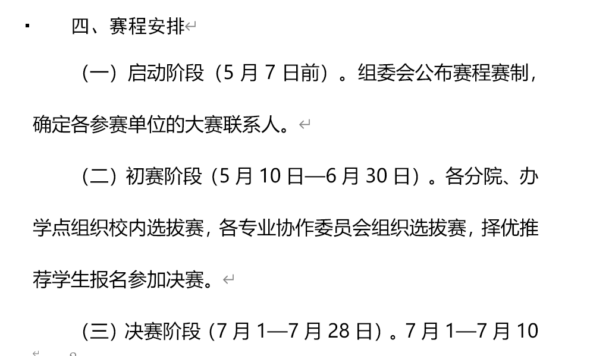
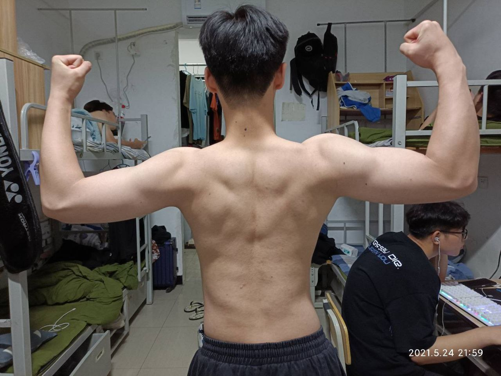
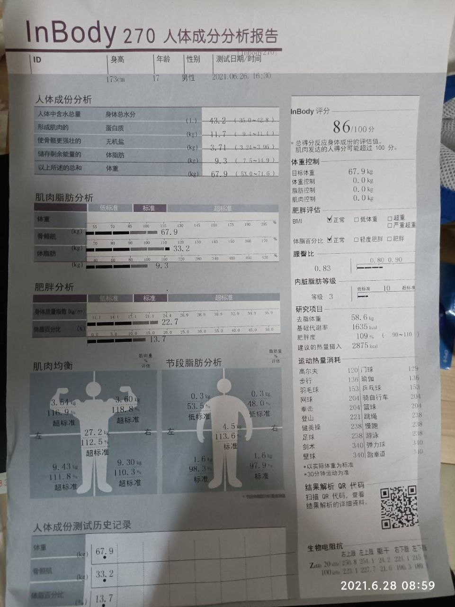
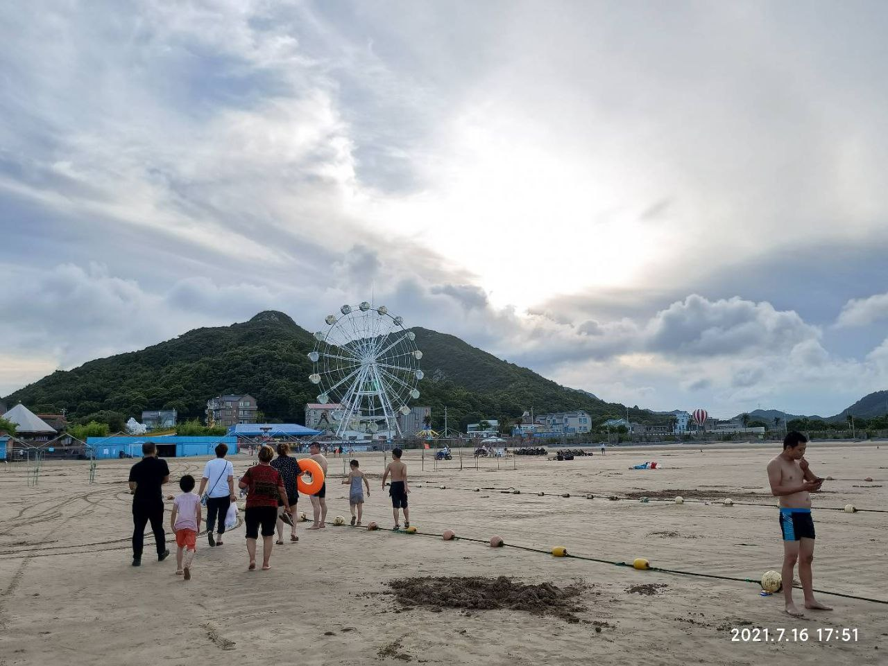

**我的2021年度报告：汗水、代码与不期而遇**

**日期：2022年1月5日** **地点：工作室**

​	最后检查一遍，拉闸，走人。窗外的天色已经暗下来，这一年，就这样在键盘敲击声、杠铃片碰撞声和偶尔的疫情通报中，匆匆划过。站在这个节点回望2021，真是五味杂陈，但又格外充实的一年。

# 健身路上的汗水成长

## 三月：不止是春天，更是"陆家门"的开端

​	2021年的春天来得有点特别。3月22日，我站上体脂秤显示58kg的瞬间，听见好兄弟说："你这身板打篮球都容易被风吹跑。"

​	3月底，看着好兄弟决心减肥，我突然也动了心思——他减脂，我能不能增重？当时我体重大概115斤左右，瘦得像根竹竿。问了我们班的"教练"同学，他大手一挥："当然可以！" 于是，一个名为"陆家门"（蹭一波鹿晨辉大神的热度）的健身小团体在我们班悄然成立。我们8个人像上了弦一样，每天下午3点45分准时集合，浩浩荡荡杀向健身房。

					(一个星期,抬不起来肘,做不了前展肱二头肌)

​	刚开始的经历现在想起来还觉得好笑。热身拉伸后试举20公斤的空杆，手臂抖得像筛糠，那一刻才真切感受到自己力量有多薄弱。但这反而激起了我的好胜心。有人带着练，氛围又好，我的进步飞快。我们风雨无阻，自律得可怕。记得练完肩的第一周，再去打篮球，发现手臂根本抬不起来，得费力地耸着肩才能勉强抬到100度角，那种酸痛感至今难忘。

​	3月22日，当同学们还沉浸在开学的喜悦中，我们工作室收到了一个重要通知——软件测试比赛将在五月举行。教练把我们召集到了403实验室，详细说明了比赛的各项要求和注意事项。由于当时疫情状况仍不明朗，每个人都需要签署一份个人健康承诺书，以备比赛期间防疫需要。

​	看着那份需要填写详细信息的表格，我们才意识到，这不是普通的小比赛。学校对这次比赛很重视，我们即将代表学校出战省级赛事。拿到承诺书的那一刻，感觉责任一下子压到了肩上，既紧张又充满期待。

## 四月：成型期的初步成效与系统备战

​	健身的第一个月（到4月24日左右），我已经开始逐渐适应训练强度。这一个月主要是适应期，肌肉记忆在慢慢形成。教练同学说这是打基础的阶段，重点是掌握正确的动作姿势，避免受伤。虽然进步不明显，但我已经能完成基本的训练动作，不再像开始时那样手抖得厉害。每次训练后的酸痛感也从最初的难以忍受变得有些"上瘾"，这种感觉告诉我肌肉在生长。

为了确保训练高效，工作室制定了严格的周计划表：
  |        | 星期一               | 星期二               | 星期三               | 星期四               | 星期五       |
  | ------ | -------------------- | -------------------- | -------------------- | -------------------- | ------------ |
  | 上午   | 自动化测试练习       | 自动化测试练习       | 性能测试练习         | 性能测试练习         | 进行一次测试 |
  | 下午   | 性能测试练习         | 自动化测试练习       |                      |                      |              |
  | 晚自习 | 计划，用例，总结练习 | 计划，用例，总结练习 | 计划，用例，总结练习 | 计划，用例，总结练习 |              |

虽然对我们这些新手来说有点吃力，但大家都很认真地按照计划执行。我也由此进入了高强度的双线模式：白天是按计划完成测试训练；下午雷打不动地冲进健身房。

在四月的训练中，我开始系统接触软件测试的各个方面：

1. **测试基础**：学习了什么是软件测试，黑盒和白盒测试的区别，以及一些简单的测试方法。

2. **简单工具尝试**：
   - 了解了Fiddler和Charles这样的抓包工具是做什么的
   - 跟着教程用JMeter录制了简单的测试脚本
   - 学会了用Postman发送基本的GET/POST请求
   - 看了一些Selenium的入门视频，知道了它可以自动操作网页

在4月到5月期间，我几乎每天晚上都泡在工作室到凌晨，疯狂练习这些工具。

### 测试与开发环境的搭建

比赛的练习也分不同场景：功能测试、性能测试和环境部署。我被分配到Linux环境负责组，开始学习基础的Linux操作：
- 熟悉常用命令，如ls、cd、mkdir等
- 尝试简单的网络配置
- 按照教程搭建基本的LAMP环境
- 

我主要负责Linux环境配置与管理，花了大量时间深入学习:
- **Linux基础命令**：从文件操作到系统管理，掌握了数百个常用命令
- **网络配置**：熟悉了防火墙设置、网卡配置、路由表管理
- **LAMP/LNMP环境搭建**：能够从源码编译安装Apache/Nginx、MySQL、PHP环境
- 

我还得跟负责Windows的队友对接好，确保整个流程顺畅。虽然忙碌，但每天都感觉自己像海绵一样在吸收，特别充实。

## 五月：薛定谔的比赛与成型期的初步成效

### 意外的竞赛变故

5月15日，就在我们满怀期待准备迎接省赛的那一周，学校突然接到通知：受疫情影响，比赛延期，具体时间待定。这个消息如同一盆冷水浇下来。

这个消息让我们有些失落，但也能理解。我们小组聚在一起吃了顿火锅，为这段共同备赛的日子画上句号。虽然没能参赛，但这段经历让我收获了：
- 软件测试的基础知识
- 团队合作的宝贵经验
- 解决问题的基本思路
- 对技术学习的浓厚兴趣

​	健身两个月（到5月24日左右），效果开始变得肉眼可见。哑铃已经能从最初的几公斤慢慢增加到能稳定完成一组12公斤的弯举。身体线条也开始有了变化，特别是手臂和肩部，已经初具形状。这时候照镜子，已经不再是当初那个"竹竿"了。教练同学看到我的进步，开始给我设计更有针对性的训练计划，增加训练强度和重量。

## 盛夏：三个月的成果与"甜蜜"的代价

​	到了6月24日，练了整整三个月，我的身体发生了翻天覆地的变化。哑铃已经能推到相当可观的重量，教练同学也让我开始尝试杠铃。杠铃的感觉确实不一样，力量增长更快了。随之而来的，是肌肉特别是胸肌和肩部出现的生长纹——这些紫红色的纹路是肌肉快速增长的证明，我们戏称这是"肉体溢出异常"，却偷偷在更衣室对比谁的纹路更狂野。

​	当体重冲到68kg时，三角肌爆出紫红色生长纹。练了大概六个月，暑假来了。因为疫情，好几个月没见父母，我便去了他们所在的宁波。在那里度过了一个漫长的暑假（疫情导致开学延迟）。期间还去了趟舟山看海(东海边)，结果兴奋过头忘了涂防晒，整个后背晒得通红，后面脱皮疼了好几天，难受得不行。

## 九月后：封校下的坚持

​	疫情反复，一直拖到将近10月才开学。没想到开学没多久，新一轮疫情来袭，学校直接封校管理。健身房去不了？工作室的训练怎么办？我们急了。我和"陆家门"的兄弟们（后来我们健身小队固定下来有11人了）一起去找班主任"软磨硬泡"，希望能有特例。最终，老师同意了我们的申请，把我们11个人的名单报给了保安处。一开始，保安大爷每次都要拿着名单一个个核对名字，后来渐渐熟了，看到我们就直接放行，还能聊上几句。9月封校期间，靠着这份11人联名担保书，我们得以继续训练。教练同学看到我们的健身包都会问："今天要debug哪块肌肉？" 并给我们定计划。在封校的大环境下，还能继续去健身房挥洒汗水，还能回到工作室继续备战，我们都觉得无比幸运。

## 最终的遗憾与坚持的意义

​	从开学起，我们就一直处于高度备战软测比赛的状态。原本说五月就有比赛，但因为疫情不断出现新病例，比赛一再延期。最终等来的消息是，比赛名额缩减，每个学校只能派一支队伍。考虑到学长们是最后一次参赛机会，且经验更丰富、更有希望拿奖，最终决定由他们代表学校出征。

这个决定让我们都有些失落，但也理解这是最合理的安排。在得知消息的那个下午，整个工作室异常安静。我们几个队员默默收拾设备，没有人抱怨。晚上，我们一起去吃了顿火锅，像是为这段紧张又充实的备赛时光画上句号。

即使没能参赛，这几个月的准备也让我获益匪浅：
- **技术能力**显著提升，从一个测试小白成长为能够驾驭多种测试工具的准专业人士
- **团队协作**能力大大增强，学会了如何在团队中承担责任并高效沟通
- **解决问题**的思路更加系统化，养成了分析问题本质的习惯
- **抗压能力**得到锻炼，能够在高强度工作下保持效率和精确度

看着学长们拿回二等奖，心里既为他们高兴，也为自己团队感到一丝遗憾。但更多的是对未来的期待——下一次，一定会是我们站在领奖台上。

# 网络世界的新发现

## 疫情时代下的信息获取革新

​	与此同时，疫情带来的种种限制和信息流通的变化，也意外地推动了我的好奇心。以前虽然接触过，但总觉得翻墙是违法的（事实上确实处于灰色地带）。但在那段时间，为了更全面地了解信息或获取学习资源，我开始主动去学习VPN相关的网络知识，了解其原理和不同协议，甚至研究了一下相关的法律知识边界，知道了哪些是明确禁止的，哪些是现实中较少被追究的。

### 网络技术的学习

这个过程中，我学习了一些网络知识：

- 学习了一些常用的网络命令，如ping和tracert
- 了解了VPN的基本原理
- 找到了一些优质的技术学习网站和资源

这些零散的知识为我打开了一扇窗，让我能够获取更多学习材料，拓宽了视野。

这算是在主线任务之外，被动触发的一个知识副本吧，但却极大地拓宽了我的技术视野，让我能够接触到更广阔的技术世界。

# 年终：早到的假期与满满的回忆

​	疫情的影响一直持续到年底，连寒假都比往年开始得更早。2021年，就在这健身房的汗水、工作室的代码、疫情带来的不确定性、关于网络边界的好奇探索以及和兄弟们互相打气的日子里走到了尾声。回看这一年，我从一个115斤的瘦子，变成了能推60公斤杠铃、身上有了生长纹"勋章"的健身爱好者；在软件测试的道路上，从理论到实践，从手动到自动化，从单打独斗到团队协作，也迈出了坚实的一步。我掌握的技术栈也有了质的飞跃,​	虽然错过了比赛，但备战过程中的学习和成长是实实在在的。最重要的是，在健身和学习这两条看似不相干的路上，我都找到了并肩作战的好兄弟，无论是"陆家门"还是工作室的队友。​	健身、学习、娱乐（和朋友们的日常互动、偶尔的放松，以及那些因好奇而进行的网络探索），这一年确实都没落下。2021年证明了我能够在多线程的生活中保持高效，这或许是最宝贵的收获。

2022年1月5日20:17，403实验室的空调定格 在26℃。我执行着最后的关机仪式：

- 给测试服务器打上"待宰羔羊"标签。
- 把JMeter压测脚本保存好。
- 在窗台留下半罐没喝完的氮泵。

当电闸拉下的瞬间，听见主机电源"滴"的一声，像极了测试用例通过的提示音。

好了，思绪收回。灯关了，门锁了。 2021，再见。 2022，我来了。
