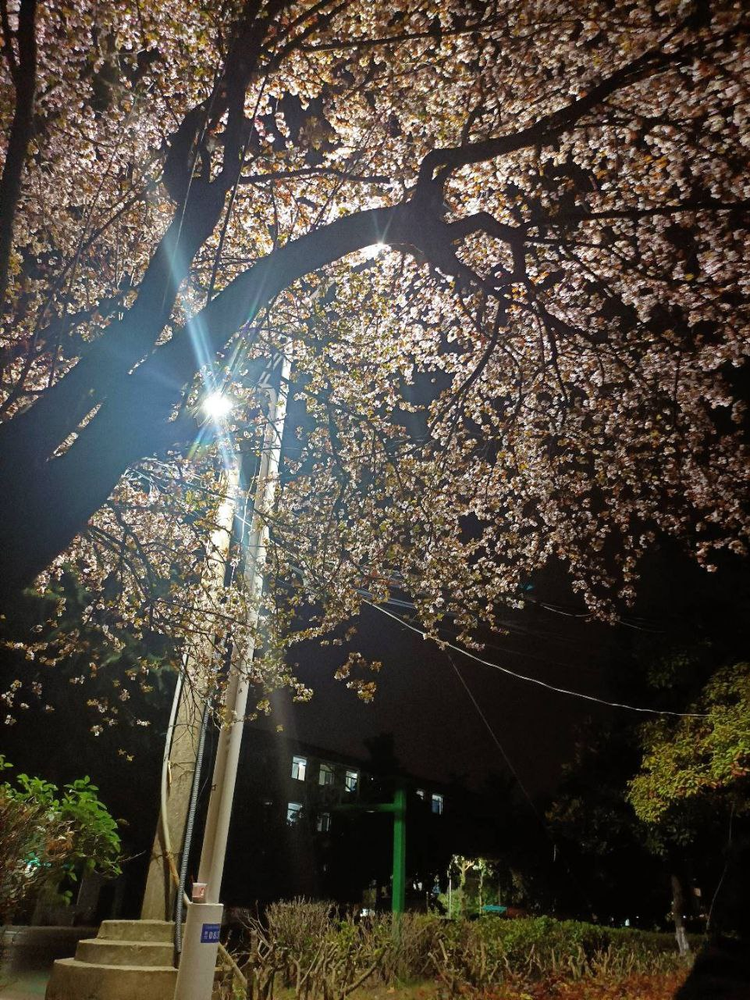
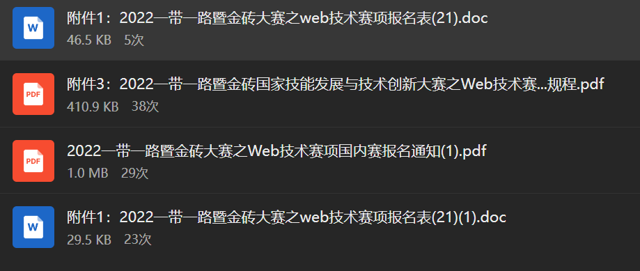
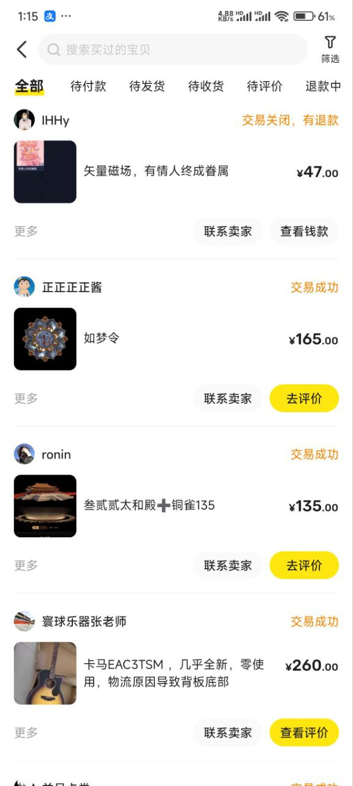
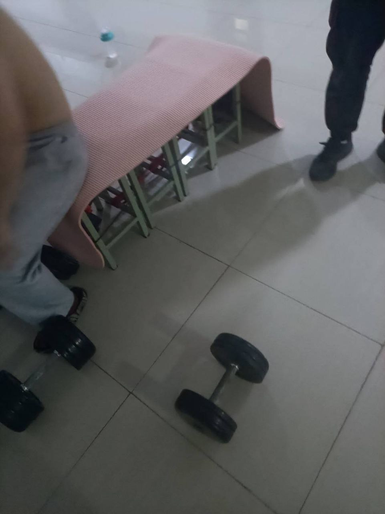
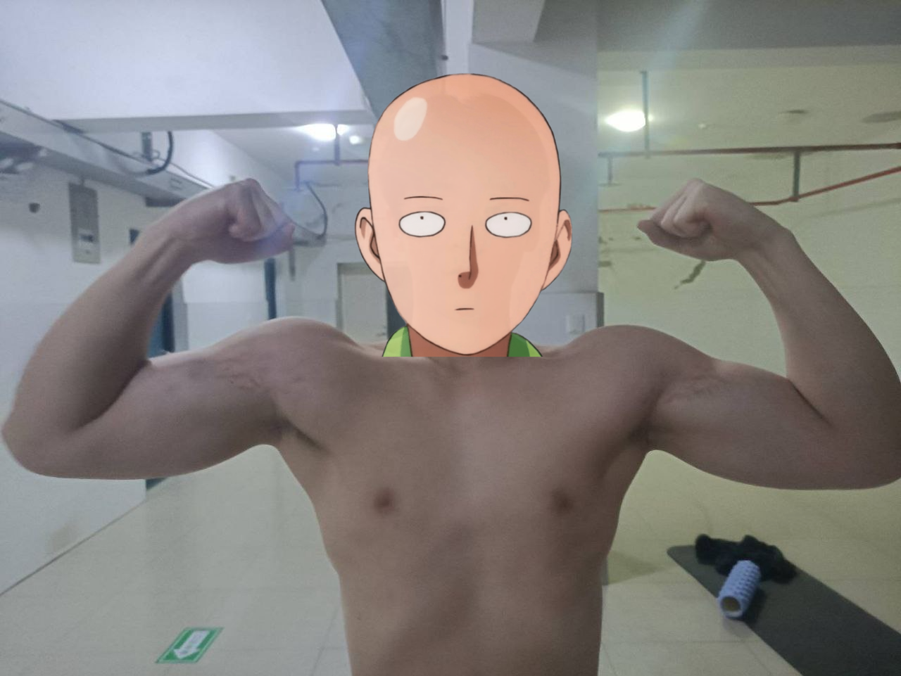

2023年1月8日，也是时候该写2022年终总结了。这一年因为疫情的反复，我经历了特殊的学习和生活轨迹，也见证了从软测到Web开发的转变历程。回顾这一年，我发现技术的道路从来不是笔直的，而是充满了各种意外转折和机遇。

<!-- truncate -->

## 开学季：疫情之下的新学期

2022年因为疫情，我们的寒假开学还算早，2月底就开学了。我也继续我的健身（尽管有一个月没练，但我的状态尚佳）和学习生活。3月的白玉兰开了，香又甜，弥漫在我的必经之路上——从宿舍到工作室，从工作室到食堂，每天都能感受到春天的气息。清甜的白玉兰香气巧妙地掩盖了校园里84消毒液的刺鼻味道，仿佛大自然在和疫情对抗，用春天的美好驱散人们心中的阴霾。每天路过那片白玉兰，总会深吸一口气，这成了我每日的小确幸。

这段时间虽然平静，但我能感受到自己的状态在逐渐恢复。健身让我保持了良好的精神状态，而学习也逐渐步入正轨。白玉兰的香气成了这段记忆的特殊标记，每当想起这段时光，我仿佛还能闻到那股清香。

## 三月：从软测到Web的转变与疫情封控

我们刚接到通知，原本两组选手都是软测选手，但现在多了一个web比赛。因此一组比软测，一组比web。web属于第一届比赛，而且我们组比隔壁组学得好，所以我们继续软测，而他们比web。

当时的选择看似简单，却在无形中为我后来的技术转型埋下了伏笔。有时候技术路线的变化往往始于一个看似普通的决定，而这个决定的影响可能要等到几个月后才能真正显现。

3月14日，疫情又严重了，这次严重到不给出校门，即使我们有特权也不行。而我的设备都在工作室，所以我什么也做不了，只能天天听音乐，刷手机，看视频，和朋友开黑。好在我们还是能在宿舍楼里活动的。我的笔记本还躺在工作室的桌子上，屏幕上停留着一半没完成的测试用例，像一个被遗弃的战场。我常常在宿舍窗口望向远处的工作室大楼，想象我的代码是否也在想念我。

这段被迫的"技术空窗期"后来看来并非完全无益。有时候，暂时的停滞反而给了我们思考和探索其他可能性的空间。

### NFT探索的小插曲

那个时候我了解了NFT，来来回回，有赚有亏，但还是被当韭菜，亏了三千多。我也了解了交易所，一开始感觉是个很神秘的东西，所以一直不敢碰，国内的政策也让我不敢碰，但NFT还是会玩一玩的（直到现在1月8号也是）。再加上我是最后一年，又要比赛又要专本，心思就不在这上面。每当看到钱包里那些价格一落千丈的NFT，我就仿佛看到了一排排嘲笑我的表情包，它们无声地告诉我："欢迎来到Web3的世界，韭菜！"

这段NFT探索虽然亏了钱，但也让我接触到了区块链这个领域，开阔了视野。了解了智能合约、MetaMask钱包、Gas费用等概念，甚至对以太坊和Solidity产生了兴趣。作为技术人，有时候"踩坑"也是一种宝贵的经验，至少我现在明白了韭菜的感受，也对这类新技术有了更理性的认识。有时想想，这可能是我交的一次"学费"，提醒自己在技术探索中保持警惕。

### 宿舍健身的开始

3月30号，因为不给出校门，所以我们只好在宿舍健身。

这看似简单的决定，却成了我在困境中保持自律的重要方式。在技术无法进步的情况下，至少身体素质可以提升。有时候，当一条路被阻断，我们需要找到另一条可以坚持的路，这或许就是面对挫折的最好方式。

## 四月：地下健身房与"冒险"故事

4月8号，疫情越来越严重，这次连宿舍楼都不给出去了。我们健身认识了一个商管的朋友，他是校篮球队的，跟我们关系不错，平常健身也在一起。得知学校有一个健身房，可以从宿舍楼进去，我们去看了看，确实不错，像地下健身房一样，宽敞还没人知道。但是，那个地方有监控，而且上来下去不方便。

我们就开始了我们的计划——把地下健身房的哑铃"借"过来。于是，我们开始在宿舍健身。虽然没有健身房好，但练了几天后，现有重量根本不满足我们，我们就决定去"借"杠铃片。全楼封闭当晚，我们像《肖申克救赎》里的安迪，只不过搬运的不是圣经而是杠铃片。晚上10点，从一楼爬到六楼，来回爬了不下4次，不敢坐电梯，怕被人发现。最重的50公斤大片子也是我搬的，给我累惨了。50kg的铸铁疙瘩贴着消防通道墙面滑行，摩擦声像极了Selenium执行失败的警报。不过这段经历让我感觉健身会上瘾，即使在宿舍我的状态也是很不错的，连宿管阿姨看到都夸我。

这段"冒险"经历现在回想起来仍让我忍俊不禁。在限制最严格的时候，我们反而激发了最大的创造力。这种"问题解决能力"某种程度上也是技术人应该具备的素质。当常规渠道不可用时，寻找替代方案并实施，这不正是技术攻关时常常需要的思维方式吗？

## 五月：重回正轨与比赛的变数

好在宿舍门口有个空地，好在这次封宿舍楼只持续了半个月，好在不给出宿舍门只持续了一个星期。五月我们又可以去工作室了，又可以出门去健身房了，所以决定把杠铃片和哑铃片偷偷的放回去。跟小偷反向操作一样，我们要把"赃物"完璧归赵。我甚至在归还时把杠铃片擦得锃亮，比"借"来时还干净，这可能是史上最负责任的"窃贼"了。

这个"完璧归赵"的过程同样刺激，但更重要的是我们恢复了正常的学习和训练节奏，这对当时的我来说是多么珍贵。有时候，平凡的日常竟也能成为一种奢侈品。重返工作室的那天，我打开电脑，看着屏幕上躺了一个多月的代码，心中五味杂陈。我花了整整一天时间重新熟悉这些软测工具，就像和久别重逢的老朋友叙旧。

回到宿舍后，隔壁组就开始web比赛。因为疫情，又加上是第一次，所以他们先比，是线上比赛，所以很水。学长在后面偷偷的给他们指点，摄像头是拍不到的，所以他们后来拿了三等奖。

看着他们就这样拿到了三等奖，心里既有羡慕也有一丝"这也太水了吧"的感觉。但转念一想，能在疫情期间举办比赛已经不易，更何况是第一届，有些不完善在所难免。

而我们软测组就没这么幸运了，一直说要比赛，又开始"薛定谔"状态——一会儿线上一会儿又说必须线下，一会儿说要比，一会儿有延迟，到最后又没比成。不过我们没有就这样难过，因为我们还有最后一次机会。

这种不确定性是最难熬的。明明付出了努力，却一直处于悬而未决的状态。在技术学习中也常有这种感觉——花了大量时间学习某项技术，却不知道它未来是否会成为主流，或者自己是否真的能用到它。但正如我们面对比赛的态度一样，唯有保持耐心和持续学习的心态，才能在不确定性中保持方向。

### VPN罗生门

学长因为开VPN下东西，校园网检测到异常，发现是我们工作室的。老师跟学长吵得不可开交，老师说学长挖矿，学长说没有。后来得知是因为学长要下软件，下了盗版的，被别人用他的网挖矿了。这件事让我瑟瑟发抖，也让我对网络安全问题有了更深的认识。老师和学长的争论就像一场技术侦探剧，双方各执一词，而真相却隐藏在网络流量的蛛丝马迹中。

这个事件给我敲响了警钟。在技术探索中，我们常常需要使用各种工具和资源，但安全和合规同样重要。一时的方便可能带来长期的风险，这是我从学长经历中得到的重要教训。这也促使我去学习了一些网络安全基础知识，比如VPN原理、防火墙设置、流量监控等概念，这些知识对我后来的Web开发也有一定帮助。

## 六月：暑假与吉他自学

六月下旬我又去了宁波。因为疫情，让我心情压抑已久，花了260买了一把破吉他自己玩。学了两个月，会弹几首歌了，比如张震岳的《小宇》，赵雷的歌和周杰伦的片段。这段时间虽然没有编程，但音乐带给我的放松和满足感也是无可替代的。宁波的夏天闷热潮湿，我常常坐在阳台上，一边弹着走调的吉他，一边听着远处的蝉鸣，这成了我那个夏天最鲜明的记忆。

吉他似乎成了那段时间我的情感出口。每次弹奏时，心中的郁闷似乎都能随着音符流淌出去。技术人也需要这样的情感宣泄方式，不然长期浸泡在代码和问题中，很容易让心态失衡。现在想来，这段学琴经历对我的心理健康起到了不小的调节作用。

## 九月：重组与Web开发的全面投入

九月我们又开学了。隔壁组的选择专本而要放弃比赛。正好，赛制规则也改了，软测只要两个人，网页要三个人，所以老师把我放到web组。隔壁组三个都要走，但是人手不足了，老师就挽留了一个。但他完全没把比赛放心上，坦白地跟我们说，他是来占一个名额的。我们的Web组就像一支临时拼凑的乐队，我这个新手鼓手被迫登台，还要和一个只想站在舞台上不弹琴的吉他手合作。

这个转变来得有些突然，但我却意外地迎来了技术发展的新机会。有时候，计划外的变化反而能带来意想不到的成长。从软测到Web，这不仅是赛道的转变，更是我技术方向的重大转折。

我们组的组长就既要比软测又要比网页，而他俩正是我的队友。我们从软测又转到web，当时健身的自律给我带来了好的习惯。每天从早六点半起床，一直到晚上十点关宿舍之前都泡在工作室。当时把FreeCodeCamp的题目前端三大件（HTML、CSS、JavaScript）都走了一遍，后面开始学习Vue、Spring Boot框架，同时Git、SVN等也学了，也尝试在Gitee上上传东西。

在这段时间，我系统学习了许多Web开发技术：
- HTML5的语义化标签和表单验证
- CSS3的Flexbox布局和动画效果
- JavaScript的DOM操作和异步编程
- Vue框架的组件化开发和生命周期
- Spring Boot的RESTful API设计
- Git的分支管理和版本控制工作流

我像海绵一样拼命吸收这些知识，生怕错过任何一个关键点。工作室的电脑成了我的第二个家，键盘上常常落满包子屑和饭粒——因为我舍不得花时间去食堂吃饭，都是叫外卖边吃边学。

这段高强度学习的日子是我技术成长最快的时期之一。我发现，健身带给我的自律和坚持能力在技术学习中同样适用。每天六点半起床，直到宿舍关门才回去，这种近乎苛刻的自律让我在短时间内掌握了Web开发的基础技能。

从前端三件套到框架学习，再到版本控制工具，我逐渐构建起Web开发的知识体系。虽然起步晚，但学习的速度却因为高强度投入而大大加快。这段经历让我明白，技术学习不仅需要时间的积累，更需要专注和高效的投入。

因为比赛就是做一个前后端分离网站，而这是才组织不到一年的比赛，老师也是散养我们，我们完全靠自己摸索前进。

"散养"的模式反而促使我们更加主动地学习和探索。没有详细的指导，我们只能自己查资料、看教程、尝试各种方案。这种自学能力对技术人来说是多么重要啊！在日新月异的技术领域，没有人能永远指导你，唯有保持自学的能力，才能不断适应变化。

## 十二月：比赛与现实

12月比赛，结果不尽人意。我们把会的都做了，我负责前端，组长负责后端，另外一个同学辅助我，帮我写HTML+CSS。结果也合乎常理地没拿下，我们没交互成功。当时老师告诉我们，如果连上了我们或许就直接二等奖了，但总要面对现实。我们的前后端就像两个相爱却无法相见的恋人，隔着一堵API的墙，怎么也连接不上。提交作品的那一刻，我们都紧张地盯着浏览器，可惜最终看到的只有冰冷的404错误页面。

这个结果虽然遗憾，但也在意料之中。我们从软测转到Web的时间毕竟有限，能做到这一步已经不易。比赛的失利让我意识到，前后端的交互和集成是Web开发中的关键环节，也是我需要在未来重点提升的技能。CORS配置、RESTful API设计、异步请求处理，这些看似简单但实际上容易出错的环节成了我后来重点学习的方向。

有时候失败比成功更有价值，它让我们清晰地看到自己的不足，也指明了未来的努力方向。技术竞赛的真正意义可能不在于名次，而在于它驱使我们高速学习和实践的过程。

## 年末总结与技术思考

2022年，我经历了从软测到Web开发的转变，学习了更多的前端技术，也在疫情封控中找到了坚持健身的方法。虽然比赛结果不如人意，但整个过程的学习和成长是无法替代的。

在健身方面，我从三月到年末一直保持着良好的习惯，即使在宿舍封闭期间也没有放弃。这种坚持不仅塑造了我的身体，也培养了我做事的毅力。健身教会我的不仅是如何锻炼肌肉，更是如何在困境中保持前进的能力。

在技术方面，我从软测到Web的转变让我接触到了更广阔的开发世界。从FreeCodeCamp的基础学习到Vue和Spring Boot的进阶，每一步都在拓宽我的技术视野。这段快速转型的经历让我相信，只要方法得当、投入足够，技术转型并非难事。

回顾这一年，我最大的收获可能是建立了自己的学习方法和节奏。高强度、持续性的学习模式让我能在短时间内掌握新技术，而健身培养的自律则是支撑这种学习模式的基础。

技术是不断变化的，唯有保持学习的能力和自律的习惯，才能在这条路上走得更远。2022年的经历让我明白，不管外部环境如何变化，只要保持内心的坚定和行动的一致，总能在逆境中找到前进的方向。

虽然年底的比赛没有取得预期的成绩，但这一年的经历告诉我：技术的成长不仅在于成果，更在于过程中的积累和坚持。失败并不可怕，可怕的是失去继续尝试的勇气。就像我在宿舍健身时"借"杠铃片那样，有时候，成功的路径并不总是那么传统和正规，但只要有明确的目标和足够的创造力，总能找到前进的方法。

展望2023年，我希望能够更深入地学习Web开发，特别是前后端交互的部分，弥补比赛中暴露出的短板。同时，我也计划继续保持健身习惯，用同样的自律态度对待身体和技术。

2023年1月8日，回望过去的一年，感谢疫情之下依然陪伴我的朋友们，感谢那些一起训练、一起学习的日子。新的一年，继续前进！

写于2023年1月8日

