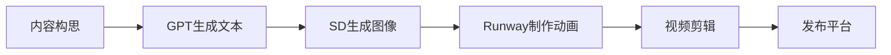

2023年12月28日，又到了写年终总结的时候了。回顾这一年，我经历了专本失利、耳鸣困扰、学习环境变化和技术方向的重新探索，这一切都在考验着我的适应能力和心态调整。与去年的Web开发之旅相比，今年的路径更加曲折，但也因此带来了更多的思考和成长。

<!-- truncate -->

## 专本之路：出乎意料的转折

### 备考的艰难时刻

比赛结束后，我只有三个月的时间备战专本。我原本计划考取第二师范学院，却在最后时刻得知二师那一年停招了。选择顿时变得更加有限，对于我的专业而言，民办院校中可能只有晓庄学院还在招生，虽然竞争最激烈，但我别无选择。

春节期间，一次与侄子放鞭炮的意外让我的耳朵受伤，患上了神经性耳鸣。回到南京后，我继续埋头复习，多亏了之前积累的基础，学习起来并不像初学者那么吃力。然而，长期熬夜和久坐导致我的抵抗力不断下降。离校的两个月里，我一直没有坚持健身，即使接种了疫苗，最终还是未能幸免于新冠病毒的侵袭。

感染新冠后，原本不太明显的耳鸣问题变得更加严重，甚至开始影响我的学习。多次医院检查后，医生开了几种药物，但效果不佳，反而有不少副作用。银杏叶片不仅没有缓解症状，反而让耳朵里的噪音更加明显；脑血管口服液则让我整天昏昏欲睡。

面对这种情况，我的备考生活几乎变成了一场与疾病和时间的赛跑：

```python
while 备考:
    刷题到凌晨2点
    耳鸣 += 10dB
    if 发烧:
        吞布洛芬继续
    else:
        灌三杯速溶咖啡
```

神经性耳鸣成了我最忠实但最不受欢迎的"学习伴侣"。医生开的处方就像一份糟糕的API文档：

```javascript
const 治疗方案 = [
    {药名: "银杏叶片", 副作用: "耳鸣增益"},
    {药名: "脑血口服液", 副作用: "强制休眠"}
];
```

### 意外的挫折

尽管我全力以赴，最终还是未能如愿考上晓庄学院。专本考试包含三门科目：C语言、计算机基础和英语。令我意外的是，我在英语科目上失了手。这对我来说是个打击，因为我自认为英语不差——我从上一年开始就坚持阅读英文文档，观看YouTube、Udemy等平台的英文视频。

有时候，技术能力与应试能力是两回事。就像一个精通React的前端工程师可能在闭卷考试中写不出完美的JSX语法一样，我的实际英语应用能力与考试成绩之间存在着不小的差距。但考试结果不得不让我面对现实：我没有考上。

## 转折与思考：寻找下一步方向

专本落榜后，我一度陷入迷茫：是直接找工作，还是考研，或者再次尝试升本？我先回到了宁波，但这次我没有像去年那样拿起吉他，而是选择了"躺平"，给自己几个月时间思考未来。这段时间就像是代码中的`setTimeout`函数，给自己一个缓冲期，让思绪有足够的时间处理这个"失败事件"。

在9月开学前的一个月，我最终决定先完成专升本，尽管内心深处更想直接踏入职场。这种选择就像在技术栈选择上的权衡：短期可能不是最优解，但从长远来看可能会为未来打下更坚实的基础。

### 婺源之旅：心灵的重启

为了调整心态，开学前我去了一趟江西婺源，度过了轻松的三天。我爬上三清山，游览博物馆，参观婺源革命遗址的山洞。山间的清新空气和壮丽景色仿佛是对我耳鸣的最好疗愈，虽然只是短暂的缓解。

这次旅行就像是给系统做了一次`reboot`，清空了缓存中的负面情绪，为即将开始的新学期做好了心理准备。一路吃喝玩乐，让我暂时放下了失败的阴影，为即将开始的新学习生涯充电。

## 新环境：期待与失望的交织

### 课堂上的失望

刚到新学校时，我对即将开始的学习生活充满期待。由于之前在工作室的经历，我对离散数学、Java GUI等课程尤其感兴趣。然而，几个月的学习后，我越发感到失望。大多数老师只是照本宣科，C++、Java这类课程的教学方式与我初学C语言时别无二致。

这种感觉就像期待尝试一款新的JavaScript框架，结果发现它只是jQuery的重新包装版本一样令人沮丧。最终，我还是通过B站大学加谭浩强老师的教材，自学完成了一学期的内容。

### 我的专属位置

在课堂上，我总是坐在最后一排靠窗的位置，那仿佛成了我的专属座位，很少有人与我争抢。座位后方有个插座，正好可以为我电池不堪重负的笔记本提供电力。这个位置就像是生产环境中一个稳定运行的服务器节点，默默地支持着我的学习活动。

于是，我利用上课时间完成了Python基础的学习。这种"前台听课，后台学习"的多线程操作，让我在课堂时间也能保持高效。

### 学习与成绩的矛盾

课程虽然让我失望，但考试却出人意料地轻松。各科成绩都在90分以上，这让我产生了一种奇怪的矛盾感。一方面，我几乎不怎么听课，大部分时间都在自学其他内容；另一方面，考试却能轻松拿高分。这就像是一个性能测试过度优化的应用程序——为了应对一个永远不会出现的高负载场景而浪费资源。

这种情况让我开始质疑这段学习经历的价值。我甚至有些不想上了，想退学，直接投入职场。那段时间，我常常打开招聘网站，浏览各种前端、后端开发的岗位要求，想象自己直接踏入工作的场景。

然而，在家人的疏导下，我最终还是决定继续学业。他们的观点很实际：文凭在求职中仍有一定的敲门砖作用，尤其是在某些大型企业的筛选环节。就像一些老旧但仍在运行的系统，虽然技术上已经过时，但由于历史原因依然在发挥作用。我决定将这段时间视为一次长期投资，耐心等待回报。

## AI热潮与技术探索

### Python与AI的初探

选择学习Python主要是因为AI技术的迅猛发展。早在去年，我就开始使用GPT，尽管它时常像个"有点笨拙的贾维斯"。我始终相信，AI相关技能是未来必须掌握的。今年，我成功学会了NumPy库的使用，并在GitHub上建立了自己的仓库，尝试一些小项目。

用Python进行AI相关开发的感觉，就像从手动测试转向自动化测试一样——简洁的代码能够完成以前需要大量人工操作的任务。NumPy的矩阵运算和数组操作，让数据处理变得异常流畅。

### AI绘画：炼丹师的旅程

当下最火热的莫过于AI绘画，特别是Midjourney和Stable Diffusion。很多人都投入到"炼丹"中——调整参数、优化模型以生成更好的图像。我跟随秋叶、Nenly、Genji等UP主学习这些技术，但随着学习的深入，我的热情却逐渐减退。

这种感觉就像学习了一套复杂的前端动画库，却发现在实际项目中很少能用到那些花哨的效果。学完这些技术后，我并不确定能将它们应用在哪里。

### AI视频与内容创作的尝试

GPT也没有像宣传的那么神奇，AI视频工具如Runway只能生成几秒钟的短片，质量也不尽如人意。虽然Python是未来趋势，但我发现以我现有的背景，在这个领域可能并不占优势。适合自己玩玩还可以，但作为职业发展方向，似乎并不理想。

我还尝试创建自己的短视频账号，利用AI生成内容：用GPT创作故事，让Stable Diffusion生成图像，再用Runway将静态图像转为动态视频，最后进行剪辑。这个工作流程就像一个复杂的CI/CD管道，每个步骤都需要精细调整。



但这个过程繁琐且困难——文本生成的上下文太短，图像质量不高，视频无法呈现复杂动作，最终只能依靠我的剪辑技巧来弥补不足。几次尝试后，我因为过于耗时而放弃了。就像一个过度工程化的项目，投入远大于产出。

## 加密货币的初探

在寻找新方向的过程中，我注册了币安账户。虽然心存顾虑，加上资金有限，我只充值了10USDT，这点钱在加密货币世界中微不足道。了解中本聪的故事后，我购买了比特币的现货并持有至今，但收益寥寥——几个月下来仅上涨了几毛钱。

这次加密货币的尝试就像是在生产环境中小心翼翼地部署一个实验性功能，投入最小的资源，观察其表现。显然，我需要更深入地了解这个领域，了解更多关于区块链技术和加密货币市场的知识。

## 年底：蓝桥杯的新挑战

在2023年即将结束之际，我做了一个重要决定：参加2024年的蓝桥杯比赛。这个全国性的程序设计大赛对我来说既是挑战，也是证明自己编程能力的机会。

我开始系统地复习算法与数据结构，从最基础的排序算法到复杂的动态规划问题。在刷题过程中，我发现自己对算法的理解仍有很大提升空间。这就像是一名前端开发者突然决定深入研究底层编译原理——需要重新调整思维方式，从应用层面转向更加抽象的理论层面。

```python
# 我的蓝桥杯准备清单
preparation = {
    "基础算法": ["排序", "二分查找", "贪心", "递归"],
    "数据结构": ["栈与队列", "链表", "树与图", "堆"],
    "进阶算法": ["动态规划", "搜索", "分治"],
    "编程语言": "Python/C++"
}
```

每天晚上，我都会抽出两小时时间刷算法题，从简单的开始，逐渐增加难度。这种逐步递进的训练方式，让我想起了健身时的渐进超负荷原则——不断挑战略高于当前能力的难题，才能持续成长。

准备蓝桥杯也让我重新思考了算法在实际开发中的价值。虽然日常Web开发中可能很少直接实现复杂算法，但算法思维对于解决问题、优化代码效率仍然至关重要。就像装修房子时，即使不需要自己制造工具，了解每种工具的特性和适用场景也能让工作事半功倍。

蓝桥杯的准备让我重新拾起了对算法和底层编程的热情，也为我的技术道路增添了一条可能的分支。虽然成绩只是一个数字，但这个过程本身——分析问题、设计算法、优化代码——已经让我收获颇丰。这也让我明白，无论未来从事什么样的技术工作，扎实的算法功底都是不可或缺的基础。

蓝桥杯的准备成为了年末的一个小小亮点，为我的2023年画上了一个充满期待的句号，也为即将到来的2024年埋下了一颗新的种子。

## 年终思考

回顾2023年，尽管充满挫折和不确定性，这一年的经历让我对自己有了更清晰的认识。我了解到自己的适应能力和学习能力，也意识到了身体健康的重要性。耳鸣问题提醒我，再强大的毅力也需要健康的身体作为支撑，就像再优秀的代码也需要稳定的服务器来运行。

技术方向的探索虽然没有找到明确的答案，但每一次尝试都在拓宽我的视野。从Web开发到AI，再到加密货币和算法竞赛，这些不同领域的体验为我未来的选择提供了更多可能性。就像一个全栈开发者，尝试不同的技术栈后，最终能找到最适合自己的方向。

蓝桥杯的准备让我重新拾起了对算法和底层编程的热情，也为我的技术道路增添了一条可能的分支。虽然成绩只是一个数字，但这个过程本身——分析问题、设计算法、优化代码——已经让我收获颇丰。这也让我明白，无论未来从事什么样的技术工作，扎实的算法功底都是不可或缺的基础。

### 2024年的期望

2024年即将到来，我希望能够：

1. 找到真正适合自己的技术方向
2. 重新建立健身习惯，保持身体健康
3. 在新的学习环境中取得更好的成绩
4. 寻找耳鸣问题的有效解决方案
5. 在蓝桥杯比赛中取得不错的成绩

对于耳鸣问题，我计划寻找更有效的治疗方法，不再让它成为阻碍我前进的绊脚石。就像修复代码中的一个持续报错的bug，需要找到根本原因而非临时规避。

而对于蓝桥杯，我不仅要完成刷题计划，还要学会"举一反三"，真正理解每种算法的核心思想，而不只是记住解题模板。这就像学习一门新的编程语言，掌握其思想比记忆语法更为重要。

无论未来如何，2023年的经历已经成为我成长道路上不可或缺的一部分。正如在工作室学习时那样，只要保持好奇心和学习的热情，总能在技术的海洋中找到属于自己的一片天地。

在2024年，我将继续我的技术之旅，无论是继续探索AI领域，深入Web开发，钻研算法竞赛，还是发现全新的技术方向，我都会带着2023年的经验和教训，更加坚定地前进。

<p align="right">写于2023年12月28日</p>