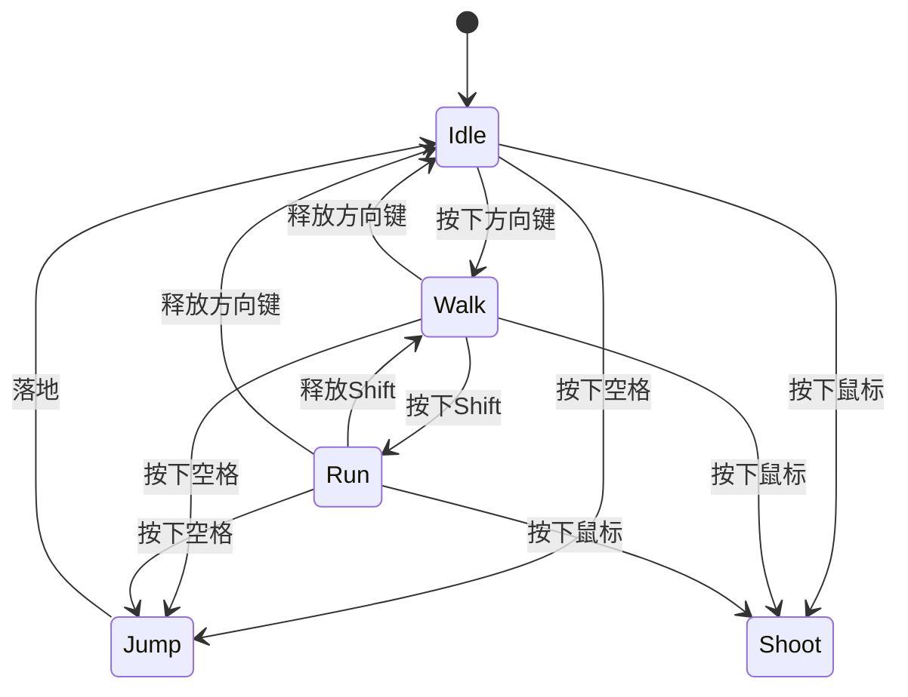

2024年12月28日，又到了写年终总结的时候。这一年，我在技术领域进行了多方位的探索，从游戏开发到运维，再到Web3和前端技术。每一次尝试都像是在代码仓库中新建一个分支，虽然不一定都能合并到主分支，但每次尝试都让我收获了宝贵的经验和技能。

<!-- truncate -->

## 游戏开发：Unity的初体验

### 从老家回来的新灵感

春节过后从老家回到南京，一次与几位叔叔的闲聊改变了我接下来的方向。了解到其中一位正在学习游戏开发，这让我也产生了兴趣。作为一名程序员，尝试不同的技术领域一直是我的习惯，就像在IDE中切换不同的编程语言一样自然。

于是，我开始了Unity的学习之旅。作为C#课代表，理解Unity的代码对我来说并不困难。这种感觉就像是从TypeScript切换到JavaScript——语法相似，只是应用场景发生了变化。

### Luna's Adventure：平面游戏的尝试

我的第一个项目是一个简单的平面游戏：Luna's Adventure。尽管只完成了一张地图，但我学习了游戏开发的基础知识，包括刚体物理、碰撞检测和角色移动控制。

```csharp
// Luna's Adventure 角色控制代码片段
public class PlayerController : MonoBehaviour
{
    private Rigidbody2D rb;
    public float moveSpeed = 5f;
    public float jumpForce = 10f;

    void Start()
    {
        rb = GetComponent<Rigidbody2D>();
    }

    void Update()
    {
        float moveDirection = Input.GetAxis("Horizontal");
        rb.velocity = new Vector2(moveDirection * moveSpeed, rb.velocity.y);

        if (Input.GetButtonDown("Jump"))
        {
            rb.AddForce(new Vector2(0f, jumpForce), ForceMode2D.Impulse);
        }
    }
}
```

这段代码虽然简单，但却蕴含着游戏开发的基本思想：响应用户输入，更新游戏状态。与Web开发中的事件监听和状态管理颇为相似。

### 2D射击游戏：深入动画系统

随后，我挑战了一个2D射击游戏的开发。这个项目让我有机会学习更复杂的游戏机制，包括角色动画（走、跑、跳、射击）以及敌人被击中后的爆炸效果。这些动画状态的管理就像是一个复杂的状态机，每个动作都由特定的条件触发。



管理这些状态的代码比第一个项目复杂得多，但我发现游戏开发中的很多模式与前端开发中的状态管理有异曲同工之妙。

### 3D开发与建模的尝试

在尝试2D游戏取得一些成果后，我开始探索3D游戏开发。这个领域的学习曲线陡峭得多，就像是从HTML/CSS直接跳到WebGL一样充满挑战。我制作了一些简单的3D演示，甚至尝试了地形编辑和3D建模。

然而，我很快发现自己在艺术设计方面天赋有限。那个丑陋的甜甜圈模型就是最好的证明——它看起来更像是被压扁的轮胎而非美味的甜点。这让我想起了自己在CSS中调整边框圆角时的挣扎：

```css
/* 我的甜甜圈模型大概就是这样的效果 */
.donut {
    border-radius: 50%;
    width: 100px;
    height: 70px; /* 应该是100px，但我做得太扁了 */
    background-color: #8B4513;
    box-shadow: inset 0 0 0 25px #FFF; /* 洞太小又不圆 */
    transform: rotate(-15deg); /* 莫名其妙的倾斜 */
}
```

### 黑神话悟空与未完成的旅程

就在我学习游戏开发五个月后，国产3A大作《黑神话：悟空》发布了。这款游戏的惊艳表现让我意识到，真正的游戏开发是一项需要长期投入和专业团队合作的工作。面对如此高的行业标准，我开始怀疑自己是否适合这个方向。

这种感觉就像是一个初学者刚写完"Hello World"，突然看到了复杂的企业级应用架构图——令人生畏且容易丧失信心。最终，我没有继续深入游戏开发的道路，但这段经历让我学到了很多关于图形渲染、物理引擎和动画系统的知识。

## 运维之路：Docker与Linux的重温

在游戏开发热情逐渐冷却后，我转向了运维领域。互联网上铺天盖地的"技术焦虑"营销让我开始思考自己的职业规划，运维似乎是一个相对稳定且有前景的方向。

我重新学习了Linux系统，深入研究了Docker容器技术。我跟着网上的课程一步步操作，但整个学习过程让我感到不太满意。

```bash
# 运维学习笔记
mkdir ~/docker-learning
cd ~/docker-learning
docker pull nginx
docker run -d -p 80:80 nginx
echo "这些命令我都会执行，但究竟为什么要这么做？"
```

许多教程过于冗长，充斥着大量的废话，没有直击要点。就像一个本可以用一行代码解决的问题，却写了一个复杂的函数，里面充满了不必要的注释和冗余逻辑。我更喜欢无废话的学习资料，直接告诉我核心概念和关键步骤。

尽管如此，这段经历还是让我对服务器架构和容器化技术有了更深入的理解，为我后来的Web开发打下了基础。

## Web3交易：加密市场的挑战

### 交易机器人与AI分析

2024年，我大部分时间都投入到了Web3和加密货币交易中。我开发了一个连接Telegram的机器人，用于计算各种市场指标并获取实时消息，然后利用AI进行市场分析。

```javascript
// Telegram Bot 代码示例
const { Telegraf } = require('telegraf');
const bot = new Telegraf(process.env.BOT_TOKEN);

bot.command('market', async (ctx) => {
    const marketData = await fetchMarketData();
    const analysis = await analyzeWithAI(marketData);
    ctx.reply(`市场分析:\n${analysis}`);
});

async function analyzeWithAI(data) {
    // 调用AI接口分析数据
    // 但结果似乎并不如预期...
    return "市场可能上涨，也可能下跌，或者横盘整理。";
}

bot.launch();
```

然而，这些工具并没有给我带来预期的收益。AI分析的结果往往过于笼统，难以指导实际交易决策。这让我意识到，我对加密市场的理解可能还不够深入。就像是在没有完全理解底层数据结构的情况下尝试优化算法——只会导致更多的问题。

### 量化交易的尝试

之后，我转向了量化交易策略的开发。我研究了剥头皮（Scalping）策略，希望通过高频小额交易获利。

```python
# 剥头皮策略伪代码
def scalping_strategy():
    while True:
        current_price = get_market_price()
        if is_buy_signal(current_price):
            buy_position = open_position(amount=0.01, type="BUY")
            wait_for_small_profit(buy_position)
            close_position(buy_position)
        time.sleep(5)  # 5秒检查一次
```

不幸的是，我经历了几次爆仓，而且即使是盈利的策略，回报率也不如银行定期存款。我也尝试过改造一些开源的量化交易项目，但由于资金和精力有限，最终没有取得显著的成果。

Web3领域的探索就像是一场没有地图的航行——充满未知和风险，但也蕴含着巨大的机遇。尽管这一年的尝试并不完全成功，但我积累了宝贵的经验和知识。

## 新的方向：远程工作与现代Web技术

### Next.js与React的学习

在多次尝试后，我决定回归Web开发，并专注于现代前端技术。我开始学习Next.js和React，希望能够找到远程工作的机会。这个决定就像是在多次分支实验后，最终选择了一条稳定且有前景的主分支。

```jsx
// Next.js 学习示例
import { useState } from 'react';

export default function Counter() {
  const [count, setCount] = useState(0);

  return (
    <div>
      <h1>计数器: {count}</h1>
      <button onClick={() => setCount(count + 1)}>
        增加
      </button>
    </div>
  );
}
```

除了前端，我还学习了Node.js后端开发以及MongoDB、Prisma和PostgreSQL等数据库技术。这种全栈开发能力让我有信心能够独立完成完整的Web应用。

### 考虑回归软件测试

在探索过程中，我也曾考虑回到软件测试领域——我的"老本行"。软件测试是一个相对稳定的领域，尤其是随着自动化测试的普及，这一职业的技术含量和市场需求都在提升。

然而，经过深思熟虑，我决定继续Web开发的道路。我相信前端技术的快速发展和远程工作的兴起，将为我提供更多的机会和更大的发展空间。

## 硬件升级：我的第一台台式机

在这一年的技术探索中，我的老笔记本逐渐力不从心。游戏开发、3D建模和前端项目的运行都对计算性能提出了更高的要求。

在哥哥的帮助下，我终于拥有了人生第一台台式机，配置了NVIDIA RTX 4060 Ti Super显卡。这台电脑的性能让我能够更流畅地进行开发工作，不再因为等待编译或渲染而浪费宝贵的时间。

这次硬件升级就像是将服务器从共享主机迁移到了专用云服务器，性能提升明显，开发体验大大改善。我对哥哥的这份支持感到无比感谢。

## 年终思考

回顾2024年，我在多个技术领域进行了尝试，虽然没有在所有方向都取得成功，但每一次尝试都让我收获了新的知识和经验。游戏开发教会了我图形渲染和动画系统的基础；运维学习加深了我对服务器架构的理解；Web3交易则让我体验了金融科技的前沿。

最终，我找到了自己真正感兴趣且有信心长期投入的方向：现代Web开发技术。就像在多个仓库之间fork和contributes后，最终找到了自己最想维护的项目。

### 2025年的展望

展望2025年，我计划：

1. 深入学习Next.js和React，掌握服务端渲染和静态生成技术
2. 构建几个完整的项目，充实个人作品集
3. 提升英语能力，为远程工作机会做准备
4. 继续关注Web3技术发展，但更加谨慎地参与
5. 保持健康的生活习惯，避免过度沉迷编程而忽视身体健康

技术领域永远处于快速变化中，但核心的编程思想和解决问题的能力是永恒的。无论未来我选择哪个具体的技术方向，我都会带着2024年的经验和教训，更加坚定地向前迈进。

<p align="right">写于2024年12月28日</p>